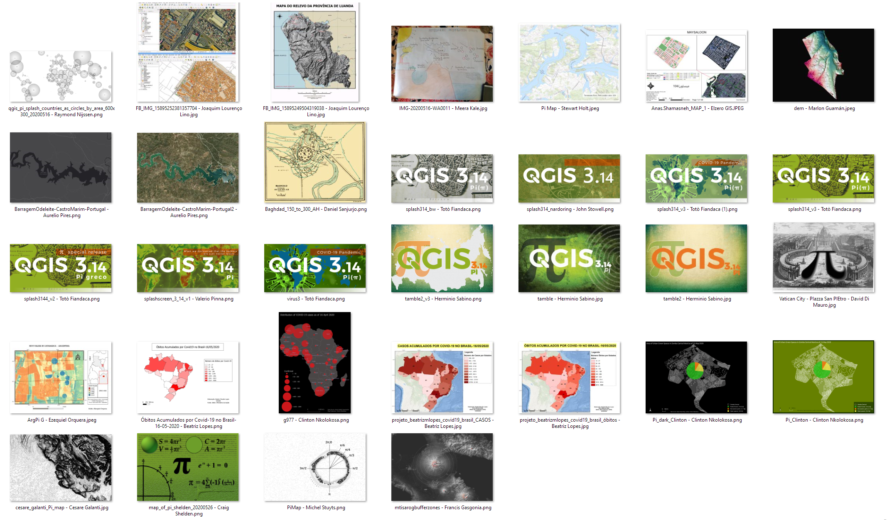

Una particularidad sobre QGIS que conoceréis quienes lleváis tiempo en la comunidad es que, hasta la fecha, las versiones de QGIS reciben el nombre de la ciudad donde se realiza el encuentro de la comunidad y la imagen que se muestra mientras se carga (la *'Splash Screen'*) muestra un mapa de la misma. Es un bonito homenaje que, sin embargo, va a verse temporalmente interrumpida.

Dado que la próxima versión de QGIS tendrá un número especial (el 3.14), la imagen y nomenclatura también serán especiales.  El nombre estaba claro desde el principio: Pi (π). Pero para la imagen de la splash screen se decidió hacer una llamada abierta a propuestas realizadas por los miembros de la comunidad que posteriormente se sometería a votación popular.

Estas son las imágenes que se presentaron a la convocatoria:

Y en [este post del blog oficial de QGIS](https://blog.qgis.org/2020/06/13/qgis-pi-mapping-contest-results/) veréis cómo se eligieron las tres  propuestas finales y el resultado de la votación final, que dio como resultado la propuesta de Francis Josef Gasgonia, que él mimo describió como: 

> "Este mapa no estaría completo sin el uso de Pi. Los topes de anillos multicéntricos representan las zonas de peligro potencial en este mapa del Monte Isarog en Filipinas. Los cálculos necesarios para desarrollar los amortiguadores de anillo dependen de Pi. El Monte Isarog está clasificado como un estratovolcán potencialmente activo. Este mapa representa mejor el uso de Pi en un mapa porque estos amortiguadores son cruciales en la planificación de desastres, especialmente ahora en un mundo de pandemia Covid-19; en el que los amortiguadores de anillo y otros tipos de amortiguadores se utilizan para la planificación humanitaria y logística"[^1].

[^1]: Traducción realizada con la versión gratuita del traductor www.DeepL.com/Translator