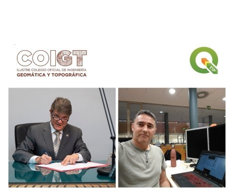

Poco a poco esta gran familia que es [QGIS España](https://www.qgis.es/asociacion/)  se va haciendo cada vez más grande, y todo gracias a vosotr@s, todos esos usuarios que habéis decidido dar un pasito un poco más allá apoyando económicamente el proyecto.

Recientemente acabamos de firmar un convenio con el [Colegio Oficial de Ingeniería Geomática y Topográfica](https://www.coigt.com/Inicio.aspx)  (COIGT) con el objeto de aunar sinergias profesionales y asociativas.

<!-- incluir la enlace?-->

[El COIGT y la Asociación QGIS España firman un convenio de colaboración](https://www.coigt.com/noticia/3012)

Este tipo de convenios tienen dos objetivos principales, por un lado contar con el apoyo de instituciones y asociaciones profesionales que fomentan el empleo de los sistemas de información soportados con QGIS, así como el desarrollo profesional continuado de sus miembros. Por otro lado, obtener beneficios conjuntos en cuanto a los actividades y encuentros organizados por ambas partes relacionados con la materia.

Contar con el apoyo del COIGT es un gran honor para nosotros, garantizando que existe una promoción de esta nuestra herramienta favorita entre sus miembros, lo que revertirá en un colectivo de usuarios cada vez más grande
