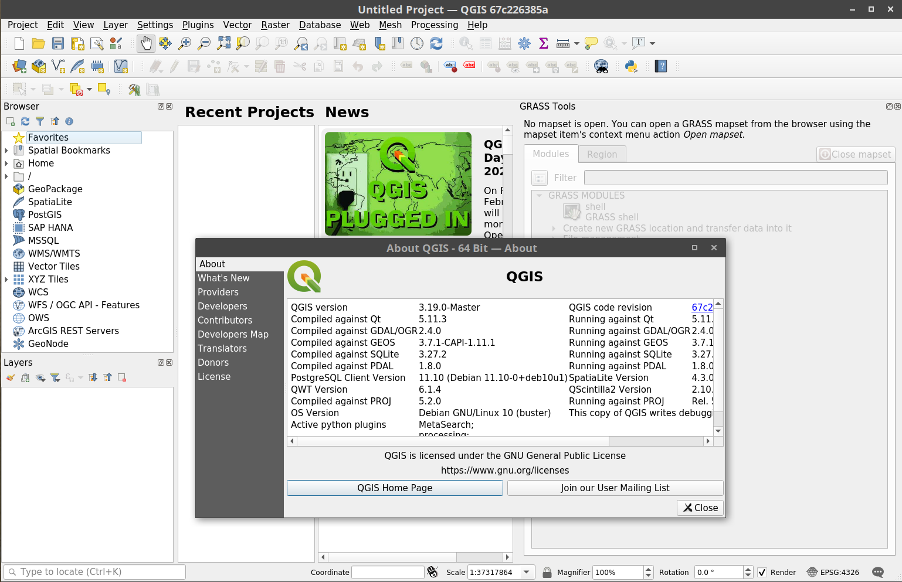
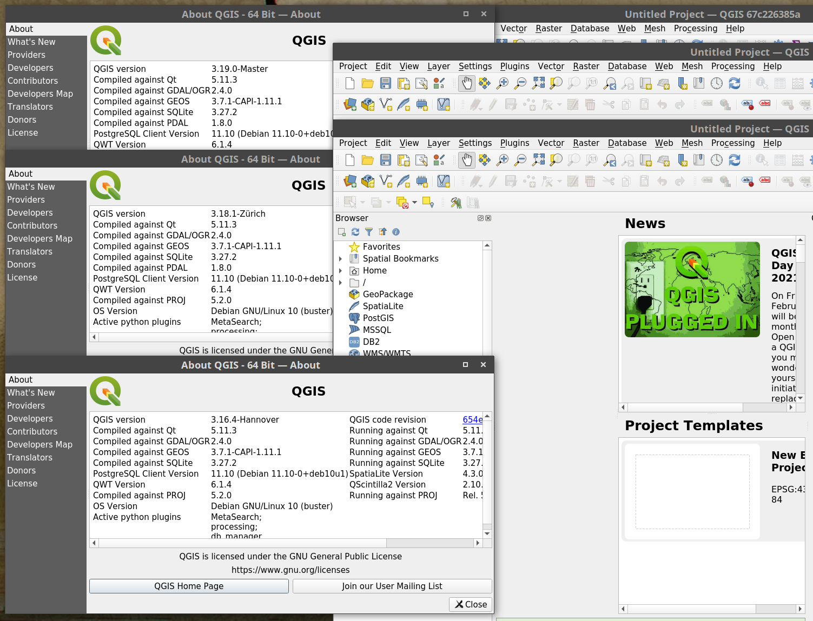

## Contenidos
<!-- TOC -->
- [Introducción](#introducción)
- [Advertencia](#advertencia)
- [Directo al asunto...](#directo-al-asunto)
- [Creación de las imágenes de Docker](#creación-de-las-imágenes-de-docker)
  - [Instalación de QGIS en Debian/Ubuntu](#instalación-de-qgis-en-debianubuntu)
  - [Configurar imagen de docker](#configurar-imagen-de-docker)
- [Corriendo QGIS desde la imagen creada](#corriendo-qgis-desde-la-imagen-creada)
- [Conclusiones](#conclusiones)
<!-- /TOC -->


## Introducción

La [virtualización por contenedores o a nivel de sistema operativo][1] usando [Docker][2] es una técnica que se ha extendido notablemente en los últimos años por su flexibilidad y sencillez para desplegar servicios y aplicaciones.

[1]:https://es.wikipedia.org/wiki/Virtualizaci%C3%B3n_a_nivel_de_sistema_operativo
[2]:https://es.wikipedia.org/wiki/Docker_(software)

En mi caso, que uso GNU/Linux como sistema operativo, concretamente [Ubuntu][3] o [Debian][4], dependiendo de la máquina, uno de los *problemas* que me encontraba si quería probar alguna versión distinta de QGIS era que debía de sustituir la que ya tenía instalada en mi sistema. También, durante mucho tiempo lo que he estado haciendo es usar una máquina virtual que montaba *ex profeso* en [VirtualBox][5].

[3]:https://es.wikipedia.org/wiki/Ubuntu
[4]:https://es.wikipedia.org/wiki/Debian
[5]:https://es.wikipedia.org/wiki/VirtualBox

Con la llegada, o más bien, mi comienzo en el uso, de Docker, mi perspectiva para la prueba de diferentes versiones de QGIS cambió al poder *mover* la virtualización de [VirtualBox][5] a una imagen de este sistema de [*virtualización ligera*][1]. En este post explico los principios básicos para hacer correr contenedores Docker con una versión personalizada de nuestro SIG de escritorio libre favorito en base a las notas que tengo en [mi repositorio de GitLab][6].

[6]: https://gitlab.com/msevilla00/qgis_docker


## Advertencia

El código que muestro a continuación está en proceso de mejora, **no me hago responsable de cualquier perjuicio que pueda ocasionar por su uso en entornos de producción**. Sin menoscabo de lo anterior puedo afirmar que todas las pruebas que he hecho con las imágenes que se comentan a continuación han sido satisfactorias.

Cualquier mejora y a portación es bienvenida a través de las [_issues_ de mi repositorio en gitlab](https://gitlab.com/msevilla00/qgis_docker/issues).

Las imágenes de docker resultantes del siguiente proceso tiene un __elevado tamaño__ (entre 2,6 y más de 3 GB) por lo que has de tenerlo presente a la hora de crear o descargarlas para correr el contenedor final.

Si quieres una imagen de QGIS generada desde la compilación del código del programa te recomiendo que le eches un vistazo a las imágenes oficiales del proyecto QGIS en [DockerHub](https://hub.docker.com/r/qgis/qgis/) o en el [repo oficial de GitHub](https://github.com/qgis/QGIS/tree/master/.docker).

La aproximación que sigo en este documento es la de recrear un sistema operativo básico en Debian y sobre él instalar la versión de QGIS que nos interesa. Como podrás leer [al final del documento](#conclusiones) es totalmente mejorable y lo he tenido presente de cara a desarrollos futuros.

El código que se presenta a continuación está bajo licencia [Creative Commons Reconocimiento Compartir igual 4.0](https://creativecommons.org/licenses/by-sa/4.0/legalcode)


<small>Foto Wikipedia</small>

## Directo al asunto...

Si no te interesan los aspectos técnicos que desarrollo más abajo y **lo único que quieres es correr QGIS desde Docker sin más dilación** te pego aquí el código para correr el programa en sus tres versiones; (1) _master/dev_ o de desarrollo, (2) _latest release_, última estable, y (3) _long term release_, versión de largo recorrido (la indicada para entornos de producción).

Si estas en GNU/Linux (lo he probado en Ubuntu y Debian) y tienes instalado Docker puedes lanzar directamente cualquiera de estos comandos sobre la carpeta que contenga los datos que vas a usar con cualquiera de los tres comandos que te pego a continuación:

```bash
# (1) para versión en desarrollo; QGIS 3.19 (master)
xhost + &
docker run --rm --name qgis_dev \
   -v $PWD:/root -v /tmp/.X11-unix:/tmp/.X11-unix \
   -e DISPLAY=unix$DISPLAY \
   msevilla00/qgis:dev qgis

# (2) para última versión; QGIS 3.18.0 (LT)
xhost + &
docker run --rm --name qgis_latest \
   -v $PWD:/root -v /tmp/.X11-unix:/tmp/.X11-unix \
   -e DISPLAY=unix$DISPLAY \
   msevilla00/qgis:latest qgis

# (3) para versión estable de largo recorrido; QGIS 3.16.4 (LTR)
xhost + &
docker run --rm --name qgis_ltr \
   -v $PWD:/root -v /tmp/.X11-unix:/tmp/.X11-unix \
   -e DISPLAY=unix$DISPLAY \
   msevilla00/qgis:ltr qgis
```




Las imágenes, la primera vez, se descargarán de [mi usuario en DockerHub](https://hub.docker.com/u/msevilla00), se creará un contener temporal y arrancará QGIS en la versión que se haya seleccionado y los datos estarán en la carpeta `Home` del programa.

Ten presente que como Docker requiere privilegios de administrador, `root`, los archivos y proyectos que crees estarán asociados a este usuario y deberás cambiarles los privilegios de escritura, `sudo chmod a+w nombrearchivo`, o cambiar el usuario propietario, `sudo chown usuario nombrearchivo` para que sean manipulables con un usuario ordinario y fuera del QGIS de Docker.

## Creación de las imágenes de Docker

Las imágenes de Docker que se han usado están montadas sobre una imagen de [Debian 10, buster](https://hub.docker.com/_/debian) a la que, como si de un sistema operativo sencillo y al uso se tratara, se le han añadido los repositorios de QGIS y se le han instalado los programas requeridos: [QGIS][6a] más [GRASS GIS][6b] y [SAGA GIS][7].

[6a]:https://qgis.org
[6b]:https://grass.osgeo.org/
[7]:http://www.saga-gis.org/en/index.html

### Instalación de QGIS en Debian/Ubuntu

En realidad lo que hice fue seguir los propios comandos que se indican [en la propia página del proyecto de QGIS][8a], que ya tengo establecidos para cualquier instalación que realizo en mis equipos, que tengo recogidos en [mi repositorio con scripts de instalación en GitLab][8b] y que resumo y comento a continuación.

[8a]:https://qgis.org/en/site/forusers/alldownloads.html#debian-ubuntu
[8b]:https://gitlab.com/msevilla00/linux_scripts

```bash
# instalar paquetes previos necesarios
apt-get install -y apt-utils curl gpg keyboard-configuration \
 nano software-properties-common ssh unzip wget

# instalar la clave de repositorio de QGIS
wget -qO - https://qgis.org/downloads/qgis-2020.gpg.key | \
  gpg --no-default-keyring --keyring \
  gnupg-ring:/etc/apt/trusted.gpg.d/qgis-archive.gpg --import
chmod a+r /etc/apt/trusted.gpg.d/qgis-archive.gpg

# añadir repositorio de QGIS (en este caso el de la varsión LR)
echo "deb http://qgis.org/debian buster main" \
    > /etc/apt/sources.list.d/qgis-latest.list

# instalar QGIS
apt install -y qgis qgis-plugin-grass

# instalar GRASS y SAGA
apt install -y grass saga
```
Por la naturaleza y las particularidades de las imágenes de Docker, hay que tener presente que se ha de incorporar un entorno de ventanas al sistema y es necesarios algunos otros paquetes que nos permiten controlar el acceso a QGIS desde el sistema en el que corramos el contenedor de Docker.

```bash
# instalación de otros paquetes adicionales
apt install -y lxqt-core supervisor xvfb 
```

### Configurar imagen de Docker: dockerfile 

El anterior conjunto de instrucciones y alguna otra adicional se han incluido en tres archivos de configuración para la construcción de imágenes de Docker, estos son, tres archivos de tipo `dockerfile`.

Aunque es recomendable echarle una ojeada a la [documentación oficial de Docker][9], sobre cómo trabajar con archivos del tipo `dockerfile`, este tipo de archivos permiten establecer las instrucciones (imagen de partida, instrucciones de instalación, variables y otras) para construir una imagen de docker.

[9]:https://docs.docker.com/engine/reference/builder/

Para el caso que nos ocupan se han generado estos tres archivos:

- [qgis_dev_buster.dockerfile](qgis_dev_buster.dockerfile) - para versión de desarrollo
- [qgis_lr_buster.dockerfile](qgis_lr_buster.dockerfile) - para versión de largo recorrido
- [qgis_ltr_buster.dockerfile](qgis_ltr_buster.dockerfile) - para última versión estable

Sobre los archivos anteriores y con el comando `docker build` sobre directorio en el que se encuentren estos archivos se podría construir cada una de las imágenes siguiendo el ejemplo, para la versión en desarrollo que se muestra a continuación:

```bash
# versión de desarrollo; QGIS 3.19 (master)
docker build -t qgis:dev -f qgis_dev_buster.dockerfile .
```
Ten presente que hay un punto al final de la instrucción que indica que se realice el comando en el directorio actual.


## Corriendo la imagen de Docker creada

Una vez que hemos construido la imagen, para que Docker trabaje con ella, Docker ha de _copiarla_ a un _container_ o contenedor, una instancia temporal que estará corriendo en tu máquina con las características de la imagen que creaste. Cada vez que lances QGIS con estas instrucciones Docker construirá un contenedor desde la imagen e iniciarás QGIS recién instalado. De hecho podrás crear cuantos contenedores desees tomando como base una misma imagen. Tienes más información sobre lo que es un contenedor en la [documentación oficial de Docker](https://docs.docker.com/get-started/#what-is-a-container).

Para que la imagen que hemos construido se transforme en un contenedor y podamos ponerla en funcionamiento lo realizaremos con el comando `docker run` tal y como se describe, para la imagen de desarrollo en las siguiente secuencia de comandos:

```bash
xhost + &
docker run --rm --name qgis_dev \
    -v /tmp/.X11-unix:/tmp/.X11-unix \
    -v ~/data:/root \
    -e DISPLAY=unix$DISPLAY \
    qgis:dev qgis
```

El código anterior costa de dos comandos: el primero permite que se acceda al control de la interfaz gráfica del sistema, `xhost`, y el siguiente, ya con el acceso permitido, corre la instrucción de Docker, `docker run` junto con una serie de opciones que genera un contenedor temporal desde la imagen y que será el responsable de correr QGIS en su interior y mostrárnoslo para su uso.

Aunque es interesante echarle un vistazo al comando `docker run` en la [documentación oficial de Docker][10] la explicación sobre el ejemplo es el siguiente:

[10]:https://docs.docker.com/engine/reference/commandline/run/

Ten presente que la barra invertida, `\` es un salto de línea para poder organizar mejor el comando que sin ellas sería todo contínuo.

La primera línea del código, tras el propio comando `docker run`, le decimos a Docker que cree un nuevo contenedor que se llamará `qgis_dev` (o el nombre que queramos darle), `--name qgis_dev` y si existe previamente lo borre y lo sustituya, `--rm`. Si quieres crear varios contenedores deberás cambiar el nombre o simplemente no indicar nada y el propio Docker le asignará un nombre aleatorio.

Con la opción `-v` gestionaremos los llamados _volúmenes_ asociados a cada contenedor, que vienen a ser, a en una explicación simple, aquellos archivos permanentes necesarios para interactuar fuera de la virtualización. 

Para lo que nos ocupa, el primer _volumen_, `-v /tmp/.X11-unix:/tmp/.X11-unix`, se relaciona con la interacción del entorno gráfico, de igual modo que la instrucción `-e DISPLAY=unix$DISPLAY`. Esto hay que dejarlo como está.

Más interesante para la ejecución del programa es el siguiente _volumen_, `-v ~/data:/root`, que nos relaciona el directorio de datos con el que queremos trabajar, `~/data`, con el directorio _home_ que tendrá de referencia el QGIS que arranque sobre el contenedor construido. Esto es, si tenemos un directorio llamado `data` en nuestro directorio de usuario, o sea, en `/home/nombreusuario/data`, y queremos trabajar en el mismo, dejaremos la instrucción como está. Sin embargo, si queremos trabajar en otro directorio debemos indicarlo ahí, o, como se ha indicado más arriba, se puede poner `$PWD` y el QGIS de Docker nos mirará en el directorio sobre el que hayamos lanzado el comando.

La última línea del código anterior es vital pues indica que imagen ha de escoger para crear el contenedor, en nuestro caso, el que hemos creado en el apartado anterior, `qgis:dev`, y después, imprescindible, el comando que ejecuta el programa en cuestión, `qgis`.

Como ya se ha comentado más arriba, las imágenes ya construidas desde los archivos `dockerfile` indicados están en [mi repositorio de DockerHub](https://hub.docker.com/u/msevilla00), por lo que si en el nombre de la imagen, simplemente incluimos, `msevilla00/qgis:dev` ó `msevilla00/qgis:latest` ó `msevilla00/qgis:ltr` dependiendo de la versión que queramos correr, el propio docker descargará, la primera vez, la imagen desde DockerHub, y lanzará el programa.


## Conclusiones



Siguiendo las instrucciones de este post podrás conseguir correr en GNU/Linux las tres versiones de QGIS de manera simultanea tal y como se muestra en la imagen anterior. Además, siempre tendrás a mano una instalación de QGIS _recien instalada_ y lista para hacer pruebas, independiente de la distribución en la que trabajes y en un entorno de ejecución ligera. Es más puedes lanzar cuantos contenedores quieras de una misma imagen, lo que te da la posibilidad de realizar múltiples pruebas.

Me de dejado algunos asuntos pendientes como compartir perfiles de usuario o _plugins_, el uso de contenedores que no sean con privilegios de administrador, `root` (la opción más directa es usar [Podman](https://podman.io/whatis.html)), o ver cómo correr estas imágenes en otros sistemas operativos, pero lo dejo para futuras entradas en este blog.

Por último, te recuerdo que le puedes echar un vistazo al [repositorio de GitLab](https://gitlab.com/msevilla00/qgis_docker) en el que me he basado para escribir esta entrada y dónde tengo el código. Y si tienes alguna sugerencia puedes añadir una entrada al apartado de _issues_ del mismo o ponerte en contacto conmigo.