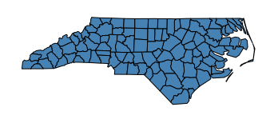
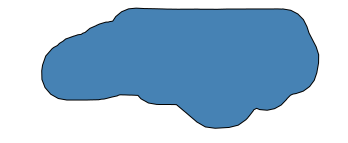

<div style="padding: 10px 10px 20px 10px; border: 1px solid #BFBFBF; background-color: white; box-shadow: 10px 10px 5px #aaaaaa;font-size: 15px">
Esta es una entrada compartida entre las comunidades de <a href="https://t.me/qgis_es">QGIS España</a> y <a href="https://t.me/rspatial_es">R Espacial en Español</a>. También la podrás leer este <a href="https://rspatial_es.gitlab.io/blog/2021-10-09-serie-flujo-de-trabajo-con-r-y-qgis-parte-1/">enlace a su blog</a> 
</div>

### Introducción

[QGIS](https://qgis.org) es uno de los software de código abierto más representativos en el mundo de los Sistemas de Información geográfica de escritorio. Si bien, forma parte de una gran lista de software de la fundación [OSGeo](https://www.osgeo.org/), existe una larga lista de empresas reconocidas que apuestan por este software ([Listado de sponsors](https://qgis.org/en/site/about/sustaining_members.html)).

[R](https://www.r-project.org/) por su parte, es un software bastante conocido por sus facilidades para el análisis estadístico. Este también ha sido aceptado tanto en el mundo científico como en el ámbito de las empresas e instituciones de estadísticas de todo el mundo. Por lo que es de esperarse que también tenga una comunidad de usuarios muy activa y un núcleo de desarrolladores muy sólido.

Este es el primero de tres entradas de blog en que mostraremos estrategias para aprovechar las potencialidades de ambos mundos. En esta primera entrada empezaremos revisando las alternativas que existen al momento de usar algoritmos de QGIS dentro de un ambiente de R. 

#### Los Algoritmos de QGIS

QGIS más allá de ser un software de escritorio también es una [API](https://es.wikipedia.org/wiki/Interfaz_de_programaci%C3%B3n_de_aplicaciones) de desarrollo. Por lo tanto tiene algoritmos que se pueden ejecutar desde una [línea de comandos](https://es.wikipedia.org/wiki/Interfaz_de_l%C3%ADnea_de_comandos). Lo que resulta muy conveniente tanto para el mundillo de los usuarios R espacial, como para otros tantos analistas espaciales (principalmente los usuarios de QGIS).

La base de toda esta entrada está claramente detallada en los apartados [22.7](https://docs.qgis.org/3.16/en/docs/user_manual/processing/console.html) y  [22.8](https://docs.qgis.org/3.16/en/docs/user_manual/processing/standalone.html) de la guía de usuario de QGIS. Aunque en versiones de la QGIS 2.x se usaba RQGIS con muy buen rendimiento, para las versiones de QGIS 3.14 en adelante no existe un paquete completamente maduro que recoja todos los beneficios de la nueva API de QGIS. Por lo tanto en los ejemplos posteriores se usará el paquete  [qgisprocess](https://github.com/paleolimbot/qgisprocess) como alternativa para ejecutar los algoritmos de QGIS processing.

#### Preparación del ambiente.

Antes de empezar a correr QGIS processing desde R,debo recomendarte que tengas listas y correctamente configuradas las dependencias con las que vas a trabajar:

- QGIS versión 3.14 o superior
- R versión 4.0.6 (también se puede usar desde 3.5 pero recomiendo usar las versiones 4.0 en adelante)
  - Paquete [rgdal](https://cran.r-project.org/web/packages/rgdal/index.html)
  - Paquete [raster](https://cran.r-project.org/web/packages/raster/index.html)
  - Paquete [sf](https://cran.r-project.org/web/packages/sf/index.html)
  - Paquete [rgeos](https://cran.r-project.org/web/packages/rgeos/index.html)
  - Paquete [stars](https://cran.r-project.org/web/packages/stars/index.html)
- GDAL 3.0 en adelante
- SAGA-GIS 2.3 en adelante
- GRASS-GIS 7.0 en adelante
- otras dependencias a tu gusto

Si eres usuario de windows, te recomiendo gestionar todas estas dependencias usando el instalador de [OSGEO4W](https://www.osgeo.org/projects/osgeo4w/)

Por otro lado, te recomiendo que le eches un vistazo a esta otra entrada de blog donde se explican detalles de cómo preparar tu [ambiente de trabajo para R Espacial](https://rspatial_es.gitlab.io/blog/2020-07-08-prepara-tu-ambiente-para-r-espacial/). Y como bono de bienvenida, para los usuarios de Linux, este estupendo vídeo de [Raúl Nanclares](https://twitter.com/rnanclares) explica en vivo como el [Entorno de Análisis GeoEspacial en Linux (Ubuntu 20.04)](https://www.youtube.com/watch?v=8Dx40TlF4fk)

{}

En linux es posible que se requiera instalar algunas librerías del sistema antes de instalar ciertos paquetes en R. Por lo cual recomiendo revisar el sitio de [Package Manager](https://packagemanager.rstudio.com/client/#/repos/1/overview) para saber los prerequisitos del sistema para cada paquete en tu distribución Linux.

### Parte 1: Trabajando con QGIS Processing desde R

El paquete `qgisprocess` es un paquete que permite ejecutar los algoritmos de QGIS processing mediante el ejecutador de procesos en línea de comandos `qgis_process`. Esta es una de las bondades de la nueva API de QGIS ya que no es necesario hacer elaborados scripts para aprovechar la caja de herramientas. _Nótese que, en esta entrada, nos referimos al paquete de R cuando se menciona `qgisprocess` (sin guión bajo), mientras que para el ejecutador de procesos de Qgis con `qgis_process` (con guión bajo)._

> The qgisprocess package wraps the qgis_process command-line utility, which is available in QGIS >= 3.14.16, released in September 2020. MacOS users will have to install a recent nightly build until QGIS 3.16 has been released; download instructions for all platforms are available at https://download.qgis.org/. If a recent version of QGIS isn’t available for your OS, you can use one of the Geocomputation with R Docker images with QGIS installed. (Dewey Dunnington, @paleolimbot)

No hay una versión estable de `qgisprocess` en CRAN. Sin embargo, se puede instalar la versión en desarrollo desde el [repositorio en GitHub](https://github.com/paleolimbot/qgisprocess).

```r
# install.packages("remotes")
remotes::install_github("paleolimbot/qgisprocess")
```

Cuando se ha instalado se puede llamar la librería de la forma habitual como se hace en R. Si todo va bien verás un mensaje como se muestra a continuación

```r
library(qgisprocess)
```

```
Using 'qgis_process' at 'qgis_process'.
QGIS version: 3.20.3-Odense
Metadata of 1539 algorithms successfully cached.
Run `qgis_configure()` for details.
```

Si algo ha ido mal, se puede ver qué ocasionó el error usando la función `qgis_configure()`. Lo que hace esta función es intentar localizar el ejecutable en línea de comando [`qgis_process`](https://docs.qgis.org/3.16/en/docs/user_manual/processing/standalone.html)

Cuando el paquete ha sido cargado y configurado correctamente en la sesión de R, ya se puede empezar a usar. Lo primero será entender cómo funciona el paquete. 

Las funciones de `qgisprocess` envían instrucciones mediante `process::run` al ejecutable `qgis_process`. El resultado es devuelto como una lista de instrucciones que son interpretadas como insumos de salida para otras funciones en R. Se verá mejor con un ejemplo:

Vamos a calcular un área de influencia (buffer) de la capa de condados de North Carolina. Necesitamos un objeto de `Simple features` para pasarle como entrada a `qgisprocess`. Entonces leeremos usando la función `sf::st_read()`

```r
  entrada <- sf::read_sf(system.file("shape/nc.shp", package = "sf"))
  plot(st_geometry(entrada), col = "steelblue") 
```



Ahora si, podemos calcular el área de influencia con el algoritmo `native:buffer`.

```r
resultado <- qgis_run_algorithm(algorithm = "native:buffer",
                                INPUT = entrada, #<- parámetro de la herramienta
                                DISTANCE = 1, #<- parámetro de la herramienta
                                DISSOLVE = TRUE, #<- parámetro de la herramienta
                                .quiet = FALSE
)
```

Lo que nos dará como resultado un objeto de clase `qgis_result`, la cual contiene las rutas a ficheros temporales que contienen las salidas del algoritmo de QGIS ejecutado mediante `qgisprocess`

```r
resultado
```

```r
<Result of `qgis_run_algorithm("native:buffer", ...)`>
List of 1
 $ OUTPUT: 'qgis_outputVector' chr "/tmp/RtmplHA5hd/file3aca38fc7913/file3aca69989e42.gpkg"
```

A partir de aquí, solo hace falta cargar este nuevo fichero a la sesión de R. Para nuestro ejemplo se puede hacer fácilmente de la siguiente manera:

```r
# Así...
buf <- sf::st_read(resultado[[1]])
# o también así
buf <- sf::st_read(qgis_output(resultado, "OUTPUT"))
plot(st_geometry(buf), col = "steelblue") 
```



En resumen, para obtener el resultado de un algoritmo de `qgis_process` se requieren dos momentos: 1) Ejecutar el proceso deseado con `qgisprocess::qgis_run_algorithm()` y 2) Leer el resultado con alguna de las funciones de R para datos espaciales, ej. `sf::st_read()`.

Para concluir sobre el trabajo con QGIS dentro de R, quiero también introducir el paquete de R `qgis` desarrollado por [Jan Caha](https://github.com/JanCaha). También es un paquete en desarrollo, por lo que solo está disponible para instalar desde el repositorio:

```r
# install.package("remotes")
remotes::install_github("JanCaha/r_package_qgis")
```

Este paquete está siendo diseñado para trabajar sobre `qgisprocess`, mediante llamadas más simples para el usuario R, incluyendo la posibilidad de tener la documentación de las librerías de _Processing de QGIS_ dentro de R. El ejemplo anterior puede ser ejecutado así:

```r
qgis::qgis_buffer(entrada, DISTANCE = 1, DISSOLVE = TRUE) |> 
  qgisprocess::qgis_output("OUTPUT") |> 
  sf::st_read()
```

```r
Reading layer `file3aca358d39d3' from data source 
  `/tmp/RtmplHA5hd/file3aca38fc7913/file3aca358d39d3.gpkg' 
  using driver `GPKG'
Simple feature collection with 1 feature and 14 fields
Geometry type: MULTIPOLYGON
Dimension:     XY
Bounding box:  xmin: -85.31306 ymin: 32.88374 xmax: -74.46764 ymax: 37.58832
CRS:           NA
```

No se recomienda cargar el paquete `qgis` completo en la sesión de R (~~`library(qgis)`~~), ya que se estaría cargando más de 900 funciones (una por cada algoritmo de Processing de QGIS). En su lugar, se recomienda llamar las funciones de la forma `qgis::qgis_buffer(...)`.

**Nota: _Los paquetes `RQGIS` y `RQGIS3` ya no tienen soporte para las nuevas versiones de QGIS, por lo que han sido descontinuados en favor de `qgisprocess`_**

Finalmente, me parece impresionante la dedicación de Dewey Dunnington  ([\@paleolimbot](https://twitter.com/paleolimbot)) y Jan Caha ([\@cahik13](https://twitter.com/cahik13)) en estos dos paquetes y la integración de QGIS en R, por lo que les agradezco infinitamente.

No se pierdan la [segunda parte del Flujo de Trabajo con R y QGIS](http://www.qgis.es/blog/2021-10-09-serie-flujo-de-trabajo-con-r-y-qgis-parte-2/) ...
