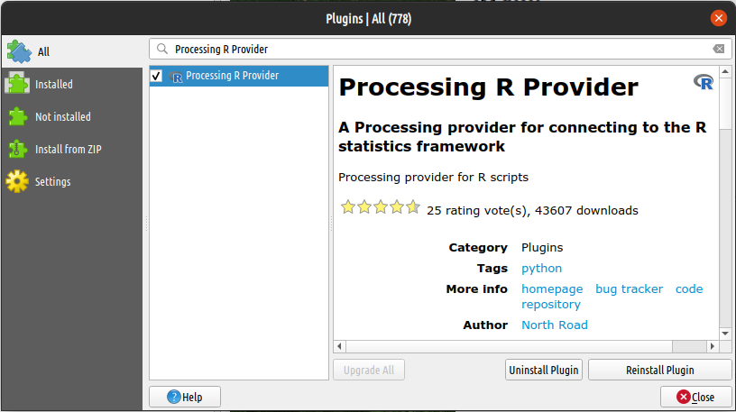
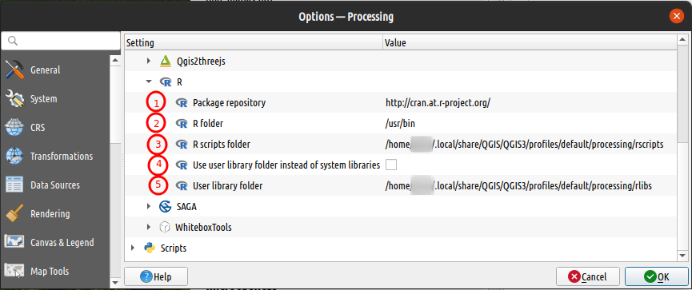
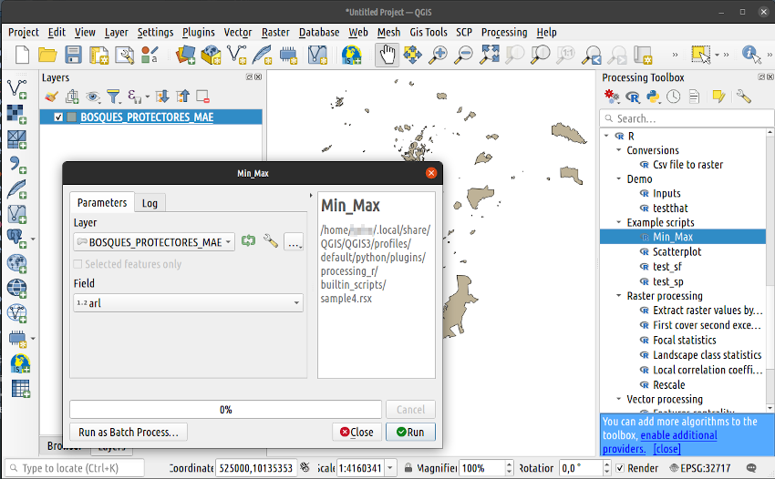

<div style="padding: 10px 10px 20px 10px; border: 1px solid #BFBFBF; background-color: white; box-shadow: 10px 10px 5px #aaaaaa;font-size: 15px">
Esta es una entrada compartida entre las comunidades de <a href="https://t.me/qgis_es">QGIS España</a> y <a href="https://t.me/rspatial_es">R Espacial en Español</a>. También la podrás leer este <a href="https://rspatial_es.gitlab.io/blog/2021-10-10-serie-flujo-de-trabajo-con-r-y-qgis-parte-2/">enlace a su blog</a> 
</div>

### Introducción

En la [entrada anterior](https://www.qgis.es/post/2021-10-09-serie-flujo-de-trabajo-con-r-y-qgis-parte-1/) explicamos cómo usar los algoritmos de _QGIS Processing_ desde una sesión de R. En esta ocasión haremos el proceso inverso de esta integración de QGIS y R. Explicaremos cómo usar bibliotecas y funciones de R desde QGIS. Para lo cual nos ayudaremos del complemento [*Processing R Provider*](https://north-road.github.io/qgis-processing-r/) que puede ser instalado desde el Administrador de complementos de QGIS


#### Lenguaje R

[R](https://www.r-project.org/) más allá de ser un software de estadística, es un lenguaje de programación orientado al análisis de datos. Aunque también permite hacer muchas otras cosas, desde automatización de procesos hasta desarrollo de aplicaciones web, aquí nos concentraremos solo en las funciones que sirvan para análisis de datos espaciales. 

La IDE más conocida para escribir código R es [RStudio](https://www.rstudio.com/products/rstudio/). Esta IDE es el producto estrella de la empresa [Rstudio PBC](https://www.rstudio.com/about/). La versión libre de Rstudio es una herramienta por demás suficiente para hacer muchas tareas de análisis espacial y desarrollo. Pero en esta entrada no nos centraremos más en esta IDE. En su lugar nos centraremos en las características propias del lenguaje R y sus indiscutibles prestaciones para ser integrado en QGIS.

Hay muchos recursos en internet para empezar con R, por citar algunos:

**Libros**

- [R para principiantes](https://cran.r-project.org/doc/contrib/rdebuts_es.pdf) [Es]
- [R para la ciencia de datos](https://es.r4ds.hadley.nz/) [Es]
- [Geocomputation with R](https://geocompr.robinlovelace.net/) [En]
- [Análisis espacial en R: Usa R como un SIG](http://eujournal.org/files/journals/1/books/JeanFrancoisMas.pdf) [Es]
- [Advanced R](http://adv-r.had.co.nz/) [En]
- [Spatial Data Science with R](https://rspatial.org/) [En]
- [Spatial Data Science (en construccion)](https://keen-swartz-3146c4.netlify.com/) [En]

**Grupos, foros y blogs**

- [RSpatial en español](https://t.me/rspatial_es): Grupo de Telegram [Es]
- [Ayuda sobre R en stackoverflow](https://stackoverflow.com/questions/tagged/r) [En]
- [Rstudio community](https://community.rstudio.com/) [En]
- [Rstudio Primers](https://rstudio.cloud/learn/primers) [En]
- [R-Spatial Blog](https://www.r-spatial.org/) [En] 


#### Preparación del ambiente.

Si ya has leído la entrada anterior, seguro ya dispones de un ambiente listo para trabajar con QGIS y R al mismo tiempo. Si no, te recomiendo que le eches un vistazo a la sección sobre [Preparación del ambiente](https://www.qgis.es/post/2021-10-09-serie-flujo-de-trabajo-con-r-y-qgis-parte-1) 

### Parte 2: Trabajando con R desde QGIS Processing

Ahora si, empezamos esta segunda parte! 

_Processing R provider_ es un complemento de QGIS que provee de herramientas de scripting con R a la caja de herramientas. Este complemento sería el análogo (un poco limitado) a las opciones de scripting con python de Processing. Por lo tanto, los scripts de R en QGIS Processing se ejecutarán como mediante las ventanas conocidas de la caja de herramientas.

#### Instalación y configuración del complemento en QGIS

Las instalación de esta extensión se puede hacer desde el desde el administrador de complementos de QGIS.



Una vez instalado, se requiere configurar desde el menú de configuración de los proveedores de herramientas de Processing. Si tienes abierto el panel de processing, basta con entrar desde el icono de opciones. Si no está abierto el panel, desde el menú *Processing* se puede activar la caja de herramientas para tener a mano la opción de configuración. Pero la forma más fiable de acceder a la configuración es desde las Opciones de QGIS. 

Sea cual sea la forma que llegues, debes acceder a la sección de `Processing/Providers`. Allí encontrarás varios proveedores de algoritmos, entre ellos R. Podrás reconocerlo por el Logo de R que lleva adelante del nombre.



Existen cinco opciones para configurar en este proveedor, a continuación detallo brevemente en qué consisten cada una:

1. _Repositorio de paquetes_. Es el enlace al servidor CRAN de donde se instalarán los diferentes paquetes de R. Es recomendable cambiar por uno más cercano a tu localidad. En esta lista puedes ver todos los repositorios que existen: [Red CRAN](https://cran.r-project.org/mirrors.html)
2. _Directorio de R_. Es el directorio donde reside el ejectutable de la consola de R. Si es en windows, localizar la carpeta de instalación de R. En Linux y Mac OS, el ejecutable se localiza automáticamente, salvo que se haya instalado en un directorio diferente al que se instala por defecto. 
3. _Directorio de scripts R_. Los algoritmos que se escriban en lenguaje R deben ser guardados en un directorio específico para que Processing pueda reconocerlos y cargarlos como herramientas. Por defecto se asigna un subdirectorio dentro del directorio de configuración de QGIS del usuario.
4. _Librerías de usuario en lugar de librerías del Sistema_. Quizá es uno de los puntos más críticos de la configuración. Si se activa, una instalación de todos los paquetes principales se realizará durante la primera ejecución de cualquiera de las herramientas de R provider. Si algún script tiene declarada alguna herramienta no principal, también se instalará durante el primer uso de esa herramienta. En el caso contrario, si no está activa, el programa buscará en los directorios de bibliotecas de R registradas por R `libPaths()`. Por lo que deberás asegurarte de tener instaladas todas las librerías que se requieran en tus scripts. Si estás en Linux y quieres tener más control, recomiendo desactivar esta opción para usar las librerías instaladas desde la consola de R o Rstudio.
5. _Directorio de bibliotecas del Usuario_. Depende de la opción anterior. Si la opción 4 está activa, se deberá definir una ruta donde guardar las librerías que se instalarán durante la ejecución de las herramientas. 

#### Vamos a probarlo.

El complemento viene con cuatro scripts de ejemplo, completamente funcionales, que podrás usarlos en cualquier momento. Todos los scripts se despliegan como cualquier otra herramienta de la caja de Processing.  



Las entradas y salidas dependen de objetos de la API de QGIS, pero en general podrás ingresar y generar vectores, raster, tablas, gráficos, otros ficheros, etc., incluso hasta podrás registrar todos los procesos de la consola de R en un fichero. Como un pequeño bocadito veamos el contenido del script de `Min_Max`:

_Encabezado_

```r
##Example scripts=group
##Min_Max=name
##Layer=vector
##Field=Field Layer
##Min=output number
##Max=output number
##Summary=output string
```

_Cuerpo_

```r
Min <- min(Layer[[Field]])
Max <- max(Layer[[Field]])
Summary <- paste(Min, "to", Max, sep = " ")
```

Como podemos ver, existen dos partes bastante fáciles de identificar: 1) El encabezado es donde se configura el comportamiento, se definen las entradas y salidas del script; y 2) El cuerpo es donde se escriben las diferentes líneas de procesos internos del algoritmo. Por el momento no entraremos en detalles, pero es un abre bocas de lo que se viene en la próxima entrada.

#### Repositorios de R scripts

Lamentablemente en la nueva versión de QGIS 3.x todavía no dispone de un repositorio central que permita descargar scripts listos para usar, tal como había en la versión 2.18. Pero el número de usuarios que tienen repositorios personales en GitHub o GitLab va creciendo. Por lo que es de esperarse que en un futuro cercano se vuelva a integrar un repositorio compartido. 

Por lo pronto, existe este viejo repositorio de [Qgis Processing](https://github.com/qgis/QGIS-Processing) con las versiones de scripts de Python y R que funcionaban en la versión 2. Este repositorio puede ser un buen punto de partida, pero requiere que se hagan modificaciones en los scripts para hacerlos funcionlaes para la versión 3.

Si no sabes como hacer esas modificaciones, ¡No te preocupes!. En la próxima entrada explicaremos cómo editar scripts o hacer desde cero tus propias herramientas para Processing. Por lo pronto ve practicando tus habilidades de programación en R.
No te pierdas la [tercera parte del Flujo de Trabajo con R y QGIS](https://www.qgis.es/post/2021-10-19-serie-flujo-de-trabajo-con-r-y-qgis-parte-3/)...

Esta vez, Gracias infinitas a  Nyall Dawson  ([\@nyalldawson](https://twitter.com/nyalldawson)) y Jan Caha ([\@cahik13](https://twitter.com/cahik13)) por mantener este complemento que originalmente fue desarrollado por Victor Olaya ([\@volayaf](https://twitter.com/volayaf)).
