<div style="padding: 10px 10px 20px 10px; border: 1px solid #BFBFBF; background-color: white; box-shadow: 10px 10px 5px #aaaaaa;font-size: 15px">
Esta es una entrada compartida entre las comunidades de <a href="https://t.me/qgis_es">QGIS España</a> y <a href="https://t.me/rspatial_es">R Espacial en Español</a>. También la podrás leer este <a href="https://rspatial_es.gitlab.io/blog/2021-10-15-serie-flujo-de-trabajo-con-r-y-qgis-parte-2/">enlace a su blog</a> 
</div>

### Introducción

Esta tercera entrega de la serie de _Flujo de trabajo con R y QGIS_ intentaremos hacer un mini tutorial para hacer nuestras propias herramientas de _Processing_ usando lenguaje R. Es importante que hayas echado un ojo a las dos entradas anteriores ([parte 1](https://www.qgis.es/blog/2021-10-09-serie-flujo-de-trabajo-con-r-y-qgis-parte-1/) y [parte 2](https://www.qgis.es/blog/2021-10-10-serie-flujo-de-trabajo-con-r-y-qgis-parte-2/)) donde se explican como configurar tu entorno de análisis espacial y la instalación del complemento [_Processing R Provider_](https://north-road.github.io/qgis-processing-r/). Además, para esta entrada asumimos que tienes conocimiento del lenguaje R y por lo menos conocimientos básicos de gestión de datos espaciales en R. Esto lo podrás confirmar si ya has tenido un acercamiento a los paquetes: `raster`, `sp`, `rgdal` y `sf`. Si aún tienes problemas con el lenguaje R, por favor no te desanimes y continúa leyendo. Es muy probable que entiendas la mayoría de los contenidos y solamente te falte aprender más sobre este útil lenguajede programación.

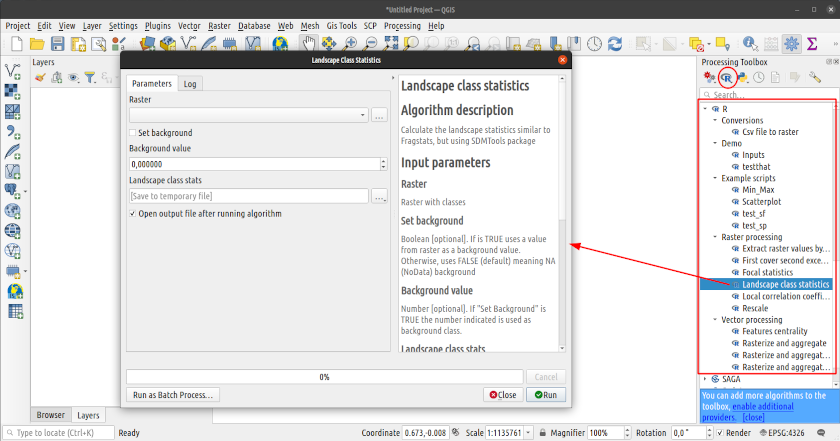

Por otra parte, deberemos aprender un poco sobre la sintaxis requerida para especificar el encabezado de un script R. Esta sintaxis se puede leer desde el [sitio oficial](https://north-road.github.io/qgis-processing-r/script-syntax/) en inglés. Pero intentaremos ir abordando diferentes aspectos de la sintaxis en esta entrada.

### Parte 3: Escribiendo herramientas para QGIS Processing en lenguaje R

Empezaremos desde lo más básico agregar scripts de R a Processing, pasando por la edición de un script con las distintas opciones de salidas de capas y tablas, hasta llegar a usar un script dentro de un proceso más complejo en el modelador.  

#### Ejercicios y datos

En esta entrada esperamos explicar todas las bases para que puedas escribir tus propias herramientas de Processing usando R. Los ejercicios que proponemos son los siguientes:

0. Obtener Rscripts con QGIS Resource sharing. 
1. Mejorar un script para Análisis de varianza con vectores de puntos y salida de tabla
2. Crear un nuevo script para Regresión local con capas raster y salidas raster
3. Estudiar opciones de salidas gráficas y numéricas
4. Uso de scripts R en el modelador de QGIS

Los datos para practicar los puedes descargar desde este enlace.

#### Nivel 0. Agregando scripts a la caja de herramientas

Como mencionamos en la [Parte 2 de esta serie](https://www.qgis.es/post/2021-10-10-serie-flujo-de-trabajo-con-r-y-qgis-parte-2/), existen algunos scripts en [este repositorio antiguo](https://github.com/qgis/QGIS-Processing) que podríamos reutilizar, haciendo unas cuantas modificaciones. Sin embargo, queremos también introducir el complemento _"Qgis Resource Sharing"_ para obtener un conjunto de scripts listos para ser usados en _Processing_.

Como todos los demás complementos, _"Qgis Resource Sharing"_ puede ser instalado desde el administrador de complementos de QGIS.

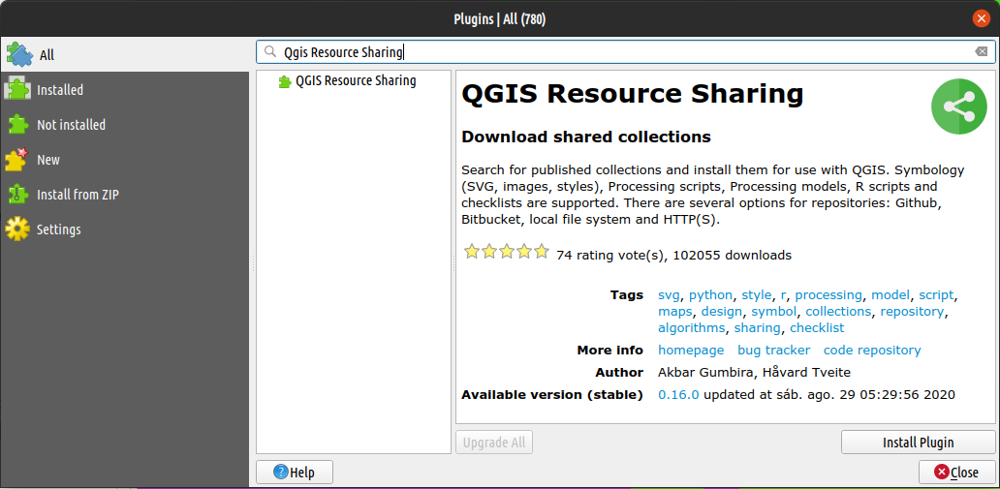

Y puedes empezar a usarlo inmediatamente desde el menú _"Web/Resource sharing"_. Podrás ver una ventana con muchísimos recursos compartidos para QGIS, donde puedes instalar una colección de R scripts, como se muestra en la imagen:

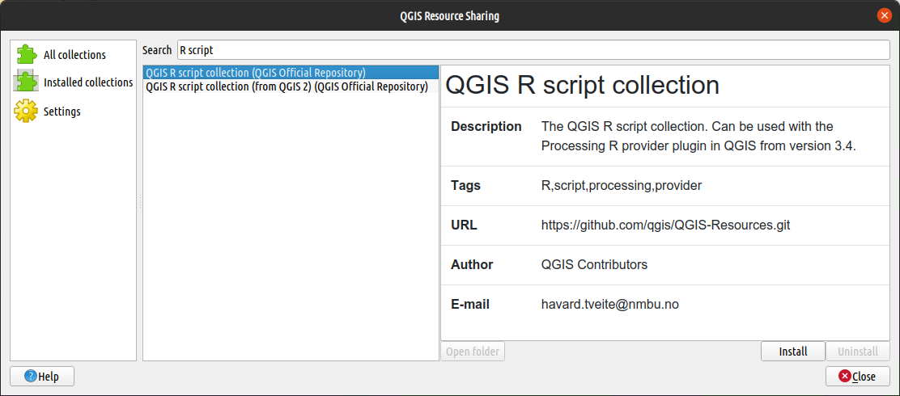

La colección completa de R scripts se instalará dentro del directorio que haya sido configurado como directorio de rscrips de _Processing R Provider_. En mi caso sería en el directorio: `~/.local/share/QGIS/QGIS3/profiles/default/processing/rscripts`. Inmediatamente después de instalar la colección, podrás ver los scripts en la caja de herramientas, como parte de los scripts de R.

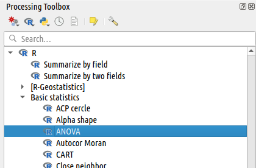

También pueden ser agregados manualmente, para lo cual será necesario copiar el fichero de extensión `rsx` al directorio de rscrips de _Processing R Provider_. Para poder ver el nuevo script en la caja de herramientas se requerirá actualizar el índice de herramientas de _Processing_. La forma más simple sería reiniciando QGIS.

#### Nivel 1. Edición de scripts 

El script que usaremos para seguir el ejercicio será `ANOVA`. Este script está guardado en el directorio de rscrips con nombre `ANOVA.rsx`. El script en cuestión puede ser editado usando... a) cualquier procesador de texto, b) en Rstudio, o c) mediante el editor integrado en el complemento de _Processing R Provider_. Nosotros usaremos el editor integrado para editar el script. Para ello, basta con hacer un clic derecho sobre el script en la caja de herramientas de processing y seleccionar _"Editar script..."_ 

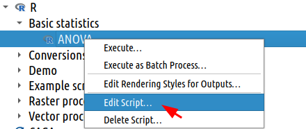

Cuando lo abras con cualquiera de los editores mencionados, podrás ver el siguiente contenido (_es el código original escrito por Laura Jeandenans_):

```r
##Basic statistics=group
##Layer=vector
##Field1=Field Layer
##Field2=Field Layer
##Field3=Field Layer
##Field4=Field Layer
##Field5=Field Layer
test1<-lm(Layer[[Field1]]~Layer[[Field2]]+Layer[[Field3]]+Layer[[Field4]]+Layer[[Field5]] )
test2<-lm(Layer[[Field1]]~Layer[[Field2]]+Layer[[Field4]]+Layer[[Field5]]  )
anova(test1,test2)
```

Nótese que el script tiene un conjunto de líneas que empiezan con `##` a las que llamaremos **encabezado**. Y las demás líneas son el código R que procesa la información de entrada, a las cuales llamaremos **cuerpo**. Las líneas del encabezado están estructuradas de la sigueinte manera: 

`nombre_parametro=tipo [valor_por_defecto/desde_variable]`

Por ahora trataremos de explicar esta parte, pero más detalles se pueden encontrar en el apartado de [_Simple specification_ de la sintaxis de scripts](https://north-road.github.io/qgis-processing-r/script-syntax/) en el sitio del plugin.

Podemos empezar incluyendo un nombre de script más explicativo. Introduciremos entonces dos líneas nuevas. La primera línea será un nombre para que _Processing_ los ordene en la lista de herramientas. Mientras que la segunda línea será para que el texto de título de la herramienta, pueda ser más explicativo para el usuario. Para eso se podrían incluir dos líneas nuevas en el encabezado. No importa el orden dentro del encabezado, pero para efectos de organización pondré estas dos líneas justo debajo de la primera línea.

```r
##Basic statistics=group
##anova=name 
##Tabla de resumen ANOVA de dos modelos=display_name
...
```

Hasta aquí el script sigue siendo funcional y usable, pero no es tan flexible para cualquier modelo lineal. Entonces, una segunda modificación es reducir el número de campos de entrada, cambiando todos los parámetros de tipo `Field Layer` a un par de parámetros de tipo `Field multiple Layer`. Además introduciremos un parámetro de tipo `Field Layer` para poder especificar una variable dependiente. Estos cambios, volverán inservible el código original del cuerpo en el rscript, por lo que también tendremos que introducir modificaciones en esa parte. Pero primero vamos por las modificaciones del encabezado. Las líneas que se introducirían en lugar de todas las otras `Field..`, serían:

```r
##Basic statistics=group
##anova=name 
##Tabla de resumen ANOVA de dos modelos=display_name
##Dependiente=Field Layer
##Independientes_1=Field multiple Layer
##Independientes_2=Field multiple Layer
...
```

Los parámetros `Independientes..` 1 y 2 son de tipo `Field multiple` que dependen de la capa de entrada `Layer`. Y serán, cada uno de ellos, un conjunto de nombres de campos de entradas para los modelos lineales 1 y 2 respectivamente. El parámetro `Dependiente` será el nombre del campo de la capa `Layer` que será la variable dependiente en ambos modelos lineales.

Ahora debemos corregir el código R del cuerpo. Para esto haremos los siguientes cambios:

1. Introducir dos líneas para crear una cadena de texto con la formula para cada test.
2. Modificar los datos en los argumentos de la función `lm()` para que coincidan con las formulas creadas dinámicamente.
3. Agregar `>` para que el resultado se guarde en un fichero externo como salida de código.

...esto sería así:

```r
##Basic statistics=group
##anova=name 
##Tabla de resumen ANOVA de dos modelos=display_name
##Layer=vector
##Dependiente=Field Layer
##Independientes_1=Field multiple Layer
##Independientes_2=Field multiple Layer

f1 <- sprintf("%s ~ %s", Dependiente, paste(Independientes_1, collapse = " + "))
f2 <- sprintf("%s ~ %s", Dependiente, paste(Independientes_2, collapse = " + "))
test1<-lm(f1, data = Layer)
test2<-lm(f2, data = Layer)
>anova(test1,test2)
```

Con esto el script estaría completo y ya se podría usar. Resaltemos que los cambios que hagamos en el encabezado, los podemos ver reflejados en la ventana de la herramienta modificada. Mientras que los cambios en el cuerpo del script solo se pueden ver en el editor del script o el log de ejecución. Aquí se puede ver la diferencia de ventanas entre ambas versiones.

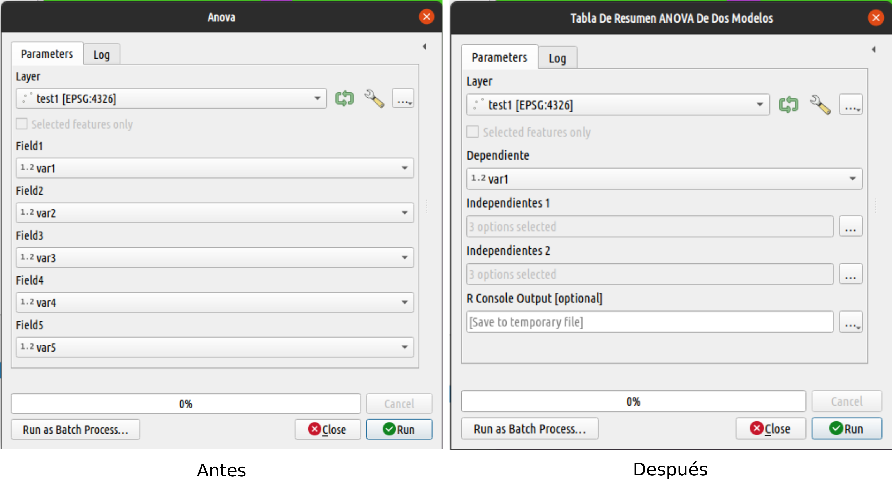

#### Nivel 2. Crear tus propios scripts desde cero

_Processing R provider_ puede ejecutar scripts creados por cualquier usario siempre que conserven la sintaxis correcta en el encabezado. El contenido del cuerpo puede ser cualquier cosa que puedas imaginar o requerir. Entonces imaginemos el siguiente escenario: 
> _Eres un usuario de SIG que requiere una tarea especial en su proyecto para la cual no dispone de herramientas en la caja de Processing. Sin embargo tiene suficientes habilidades para resolver el procedimiento en R. Te interesa implementarlo como herramienta de QGIS para usarlo en cualquier ocasión_. 

El ejercicio propuesto para este fin es una herramienta que permita hacer un análisis de correlación local entre dos capas raster. Para empezar, necesitamos abrir una nueva ventana del editor desde el menú de R (logo de R) en la caja de herramientas de processing: `R/crear nuevo script R`

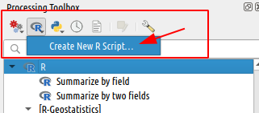

La ventana del editor estará completamente vacía. En ella deberemos insertar las líneas de encabezado y luego el cuerpo del script. Para efectos de este ejercicio, proponemos el siguiente contenido:

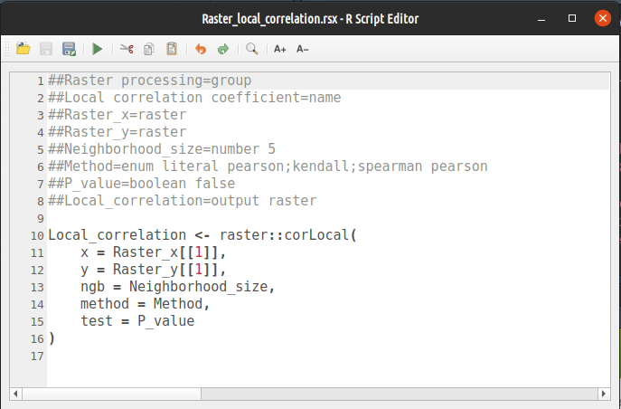

Las líneas 1 y 2 contienen metadatos para organizar el script dentro de las herramientas de processing. Estas quieren decir que será un nuevo algoritmo dentro del grupo de herramientas `Raster processing` y que llevará por nombre `Local correlation coefficient`. Si el script carece de estas dos líneas, processing simplemente la pondrá fuera de cualquier grupo de herramientas y con un nombre derivado del nombre del fichero `rsx` con el que fue guardado el algoritmo. 

```r
##Raster processing=group
##Local correlation coefficient=name
```

Las líneas 3 a 7, contienen los parámetros de entradas para el algoritmo. Estas líneas permitirán desplegar distintos tipos de mini-aplicaciones de acuerdo a lo que necesitemos en nuestro algoritmo. Por ejemplo con las líneas 3 y 4 haremos que de forma obligatoria el usuario ingrese una capa raster en cada uno de ellos. Los demás parámetros de entradas varían en el tipo de entrada y la configuración. Pero todos guardan una estructura similar: `Nombre_del_parametro=tipo <opciones o valor por defecto>`. En la tabla de [este enlace](https://gitlab.com/gavg712/QGIS_Processing_R_scripts/-/wikis/QgsParameters-inputs) podrás ver los tipos de parámetro de entrada disponibles para tu script.

```r
##Raster_x=raster
##Raster_y=raster
##Neighborhood_size=number 5 
##Method=enum literal pearson;kendall;spearman pearson
##P_value=boolean false
```

La línea 8, es un parámetro de salida de tipo raster. El nombre que uses en esta línea deberá ser el nombre de uno de los objetos raster que se generen en el cuerpo del algoritmo. De la misma manera que con los parámetros de entrada, los parámetros de salida pueden ser de distintos tipos: `vector`, `raster`, `tabla`, `file`, `folder`, `number`, `string` y `consola`. En [este enlace](https://north-road.github.io/qgis-processing-r/script-syntax/) podrás ver más especificaciones, pero todas tienen en común la siguiente estructura:
`Nombre_de_salida=ouput tipo <opciones>` donde _"output"_ es una palabra obligatoria para que processing pueda identificar que se trata de una `salida`. El algoritmo podría tener más de una salida de acuerdo a nuestras necesidades.

```r
##Local_correlation=output raster
```

Hasta este punto _Processing R provider_ hará chequeos previos de la estructura del script. De haber errores puede ocurrir: 1) si una línea incorrectamente escrita no sea reconocida como una estructura válida, el script mostrará un error al momento de ejecutar la herramienta; y, 2) si el nombre del script no contiene la extensión `rsx` o tiene un nombre repetido con otra herramienta de R, no se mostrará dentro de la caja de herramientas de processing.


El resto de líneas de este ejemplo corresponden al cuerpo del script y se deberán escribir exactamente de la forma que el intérprete de R pueda reconocer. Cualquier error en el código no será reconocido por processing hasta el momento de ejecutar la herramienta, para lo cual la pestaña de "Log" podrá servir para interpretar cuál fue el error.

```r
Local_correlation <- raster::corLocal(
    x = Raster_x[[1]],
    y = Raster_y[[1]], 
    ngb = Neighborhood_size,
    method = Method, 
    test = P_value
)
```

A continuación te dejo el script completo por si quieres usarlo como una herramienta para ti:

```r
##Raster processing=group
##Local correlation coefficient=name
##Raster_x=raster
##Raster_y=raster
##Neighborhood_size=number 5 
##Method=enum literal pearson;kendall;spearman pearson
##P_value=boolean false
##Local_correlation=output raster

Local_correlation <- raster::corLocal(
    x = Raster_x[[1]],
    y = Raster_y[[1]], 
    ngb = Neighborhood_size,
    method = Method, 
    test = P_value
)
```

Una última parte, opcional pero muy importante, sería crear la ayuda del algoritmo. Es un paso adicional que te permitirá describir los parámetros de entrada y salida de tu algoritmo y así poder tener una explicación a mano cuando ejecutes la herramienta. Esta ayuda se mostrará en la sección de ayuda de la ventana.

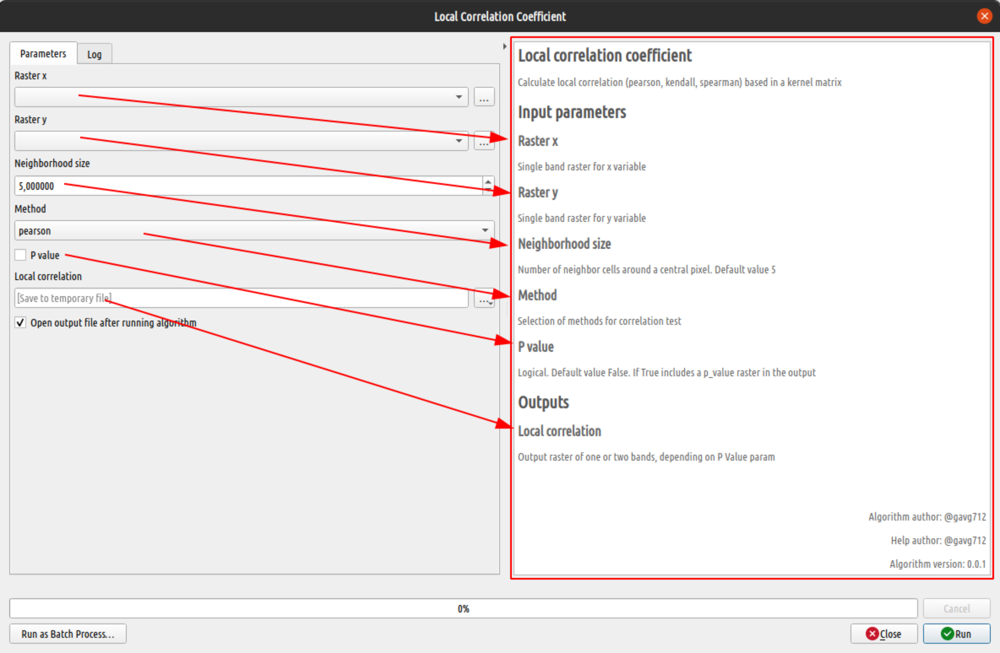

Escribir la ayuda es bastante sencillo, pues consiste en crear un fichero de texto en el mismo directorio de rscrips, con el mismo nombre del script, pero con la extensión `rsx.help`. El fichero debe contener un objeto _json_ con la explicación de cada uno de los parámetros. Por ejemplo:

```json
{
"ALG_DESC": "Calculate local correlation (pearson, kendall, spearman) based in a kernel matrix", 
"ALG_CREATOR": "@gavg712", 
"ALG_HELP_CREATOR": "@gavg712",
"ALG_VERSION": "0.0.1",
"Raster_x": "Single band raster for x variable", 
"Raster_y": "Single band raster for y variable", 
"Neighborhood_size": "Number of neighbor cells around a central pixel. Default value 5", 
"Method": "Selection of methods for correlation test", 
"P_value": "Logical. Default value False. If True includes a p_value raster in the output",
"Local_correlation": "Output raster of one or two bands, depending on P Value param"
}
```

Las palabras: `"ALG_DESC"`, `"ALG_CREATOR"`, `"ALG_HELP_CREATOR"` y `"ALG_VERSION"` son palabras especiales que permitirán agregar más información a la ayuda del script. Por otro lado, Si los nombres de los valores de la ayuda no coinciden con los nombres del Script, simplemente serán omitidos de la ayuda en la ventana. Como entrenamiento te propongo que corrijas el fichero de ayuda del algoritmo `ANOVA.rsx`, como verás con los cambios que hicimos la ayuda no sirve de mucho. Vamos hazlo!

#### Nivel 3. Otros tipos de salidas.

Existen más tipos de salidas que no necesariamente son objetos espaciales, pero pueden ser el resultado de un rscript. Por ejemplo un gráfico estadístico, un valor numérico o una cadena de texto. En los siguientes ejemplos veremos dos algoritmos que generan salidas no espaciales.

El primero es un algoritmo para hacer un gráfico de tenencia, muy útil para estudios de textura de suelos:

```r
##Vector analysis=group
##Tenary plot=name
##Layer=Vector
##X= Field Layer
##Y=Field Layer
##Z=Field Layer
##Group=optional Field Layer
##output_plots_to_html

library("ggplot2")
library("ggtern")

ggplot()+
  geom_point(mapping =
        if (!is.null(Group)){
            aes(Layer[[X]],Layer[[Y]], Layer[[Z]])
        } else {
            aes(Layer[[X]],Layer[[Y]], Layer[[Z]], 
            color = as.factor(Layer[[Group]]), 
            group = as.factor(Layer[[Group]]))
        }
  )+
  coord_tern() +
  xlab(X)+
  ylab(Y) +
  zlab(Z) +
  theme_showarrows() +
  theme(legend.title=element_blank())
```

Aquí podemos ver que la linea `##output_plots_to_html` tiene una estructura diferente a las que hemos visto hasta ahora. Se trata de una línea que modifica el comportamiento del script. En este caso en lugar de devolver un objeto, el algoritmo generará un fichero `html` que contendrá el gráfico generado. El homólogo de esta instrucción para versiones antiguas de _Processing R provider_ es `##showplots`, que todavía se puede usar.

Para nuestro segundo ejemplo, retomaremos el script *"Min_Max"* que habíamos visto en la entrada anterior. El contenido de este script es:

```r
##Example scripts=group
##Min_Max=name
##Layer=vector
##Field=Field Layer
##Min=output number
##Max=output number
##Summary=output string

Min <- min(Layer[[Field]])
Max <- max(Layer[[Field]])
Summary <- paste(Min, "to", Max, sep = " ")
```

Se pueden ver tres líneas de `output`. Dos de ellas son números y una es un texto. Cuando se ejecuta este script, no se verá ningún tipo de resultado ni gráfico ni espacial. Sin embargo, si se fijan en la pestaña Log de la ventana de ejecución, podrán ver (casi al final) la siguiente línea:

```json
{'Max': '9.721', 'Min': '5.16', 'Summary': '5.16 to 9.721'}
```

Esto significa que el resultado será devuelto como variable dentro del contexto en el que se use el rscript y podrá ser usado como entrada en alguna otra herramienta de _Processing_, como lo veremos en la próxima parte de esta entrada.

#### Nivel 4. Usando R scripts en el Modelador

Este es nuestro cuarto nivel del tutorial y veremos como utilizar salidas de R como entradas en otros algoritmos de _Processing_. Para esto vamos a utilizar el modelador de QGIS y el algoritmo *"Min_Max"* que antes hemos visto.

Como se vió más arriba, este algoritmo genera un objeto json que estará disponible como variables dentro del contexto en el que se use, en este caso del modelador. Entonces, las aprovecharemos dentro de un modelo de ejemplo que nos permita generar un raster de valores aleatorios a partir de los valores mínimo y máximo de un campo en una capa de vectores. Si todavía no sabes como hacer modelos en QGIS, te recomiendo mirar este enlace: [QGIS training manual: Modeler only](https://docs.qgis.org/3.22/en/docs/training_manual/processing/modeler_only.html). El modelo propuesto es el siguiente:

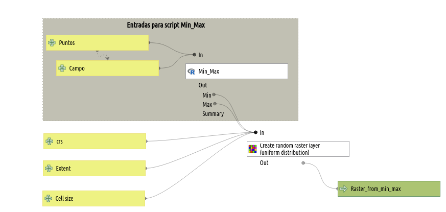

El enlace entre las salidas del Rscript y la entrada en la otra herramienta de processing se realiza mediante una expresión en los parámetros de límite inferior y límite superior (_"Lower bound..."_ y _"Upper bound.."_) como se muestra en la imagen a continuación. 

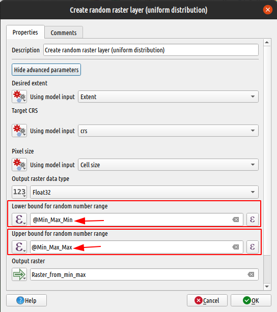

De esta manera se puede aprovechar un rscript como insumos para otros procesos en el modelador. Debo recalcar que esto no es exclusivo de _Processing R provider_, sino es una de las bondades de la nueva API de _Processing_.

#### Nivel 5: Especificación avanzada

Todos los parámetros de entradas y salidas pueden ser especificados mediante una estructura especial que permitirá tener mayor flexibilidad. Es especialmente útil al momento de definir los parámetros de entrada. Se trata de usar las clases y propiedades de Python para objetos `QgsProcessingParameter*`. Veamos un ejemplo: La misma especificación del encabezado del script de ANOVA.rsx podemos escribirla así:

```r
##Basic statistics=group
##anova=name 
##Tabla de resumen ANOVA de dos modelos=display_name
##QgsProcessingParameterVectorLayer|Layer|Capa de entrada|-1|None|False
##QgsProcessingParameterField|Dependiente|Variable dependiente|None|Layer|0|False|False|False
##QgsProcessingParameterField|Independientes_1|Variables independientes modelo 1|None|Layer|0|True|False|False
##QgsProcessingParameterField|Independientes_2|Variables independientes modelo 2|None|Layer|0|True|False|False

f1 <- sprintf("%s ~ %s", Dependiente, paste(Independientes_1, collapse = " + "))
f2 <- sprintf("%s ~ %s", Dependiente, paste(Independientes_2, collapse = " + "))
test1<-lm(f1, data = Layer)
test2<-lm(f2, data = Layer)
>anova(test1,test2)
```

Aquí vemos que las líneas que empiezan con una especificación de tipo `QgsProcessingParameter*` y continúa con valores separados por una barra vertical `|`. Esos valores corresponden a un atributo de la clase en el mismo orden que han sido definidos en Python. De esta manera podremos tener más control sobre el parámetro. Por ejemplo, nótese que en esta especificación podemos usar como nombre del objeto R `Layer`, mientras que el enunciado que aparecerá en la ventana de la herramienta es `Capa de entrada`. Así también para los parámetros de las variables hemos controlado que los tipos de campos aceptados sean solo numéricos.

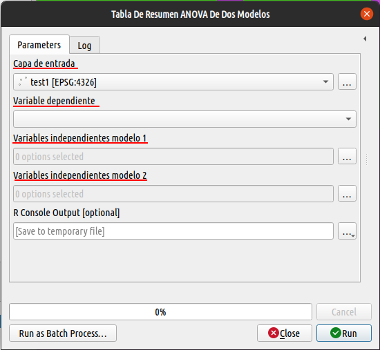

Cada tipo de parámetro de entrada o salida tiene su propia lista de propiedades que pueden ser controlados. Si quieres saber que propiedades tiene un parámetro específico, puedes consultar la [documentación de PyQgis](https://qgis.org/pyqgis/master/search.html?q=QgsProcessingParameter&check_keywords=yes&area=default). 

Y hasta aquí la entrada de hoy. Como hemos visto desde la parte 1, trabajar con R y QGIS juntos es bastante sencillo. Los desarrolladores de ambas partes están haciendo un esfuerzo enorme para brindarnos a los usuarios las herramientas para mejorar nuestros análisis de SIG. Solo hace falta aprender la lógica del trabajo para aprovechar ambos mundos. 

No puedo más que sugerirte tomar parte de este crecimiento siguiendo alguna o varias de estas pautas:

- Si ves algún comportamiento extraño en cualquiera de las herramientas que te he mostrado en esta serie de entradas, puedes reportar a los desarrolladores en sus respectivos repositorios.
- Si tienes habilidades de traducción, puedes compartir esta información o la documentación oficial a otros usuarios en otros idiomas.
- Si tienes un poco de dinero que puedas apoyar a las iniciativas, contacta a los desarrolladores. Siempre les vendrá bien el soporte económico para el proyecto.
- No menos importante tu conocimiento puede ayudar a muchos más, usa licencias libres para compartir tus desarrollos.

Muchas gracias por leer esta serie. Nos leeremos en una próxima oportunidad.
