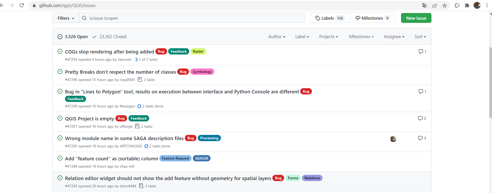
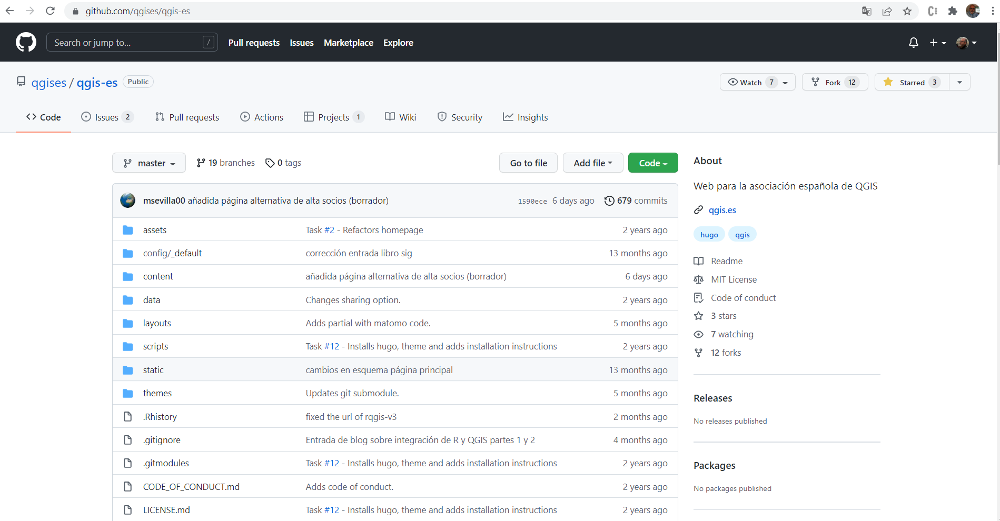
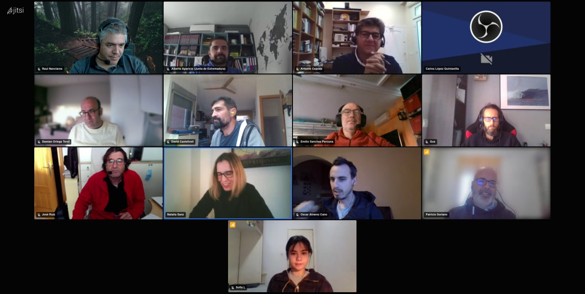

Cuando pensamos en la posibilidad de contribuir en un proyecto abierto como QGIS, siempre se nos viene a la cabeza aportaciones que conllevan el desarrollo de código. 

Sin embargo, no todos estamos capacitados para mejorar un bug del programa o desarrollar una nueva funcionalidad para que se incorpore en los nuevos lanzamientos. Esto no quita que existan otras acciones de igual relevancia que podamos realizar como apoyo a QGIS y que no requieren conocimientos de programación.

## ¿Cómo contribuir al proyecto QGIS?

En la misma página web del proyecto encontramos [la relación tareas con las que aportar nuestro granito de arena a la comunidad QGIS](https://www.qgis.org/es/site/getinvolved/index.html).

- **Informar de errores**. Ya que QGIS es un SIG en continua mejora, puede ocurrir que aparezcan errores (*bugs*) en nuevas funcionalidades, que exista algún fallo de traducción o que detectemos alguna carencia en la página web. Identificar, describir y reportar estos errores en los distintos [canales habilitados](https://www.qgis.org/es/site/getinvolved/development/bugreporting.html#bugs-features-and-issues) para ello  será de gran ayuda para su corrección.

- **Participar en los canales de soporte**. ¿Qué mejor manera de promover el uso de QGIS que ayudar a otros a conocer mejor este SIG de código abierto? Hay un amplio [número de canales, listas de correo, chat, grupos](https://www.qgis.org/es/site/forusers/support.html) de usuario donde puedes ayudar a resolver dudas. Para usuarios de lengua española está la [lista de correo en español](https://lists.osgeo.org/mailman/listinfo/qgis-es) y el [canal de Telegram](https://telegram.me/qgis_es)
- **Escribir Documentación** Los manuales y guías de uso vienen genial cuando estamos comenzando a aprender QGIS. Pero lamentablemente no se hacen solos. Existe un [grupo específico y una guía de estilos](https://www.qgis.org/es/site/getinvolved/document.html) de apoyo para colaborar en este sentido. Si contamos con una página web personal o corporativa podemos también escribir entradas sobre nuestra experiencia con QGIS.
- **Traducciones**. ¿Sabes que QGIS se encuentra traducido a cuarenta idiomas? Si estás [interesado en que QGIS esté en tu idioma](https://www.qgis.org/es/site/getinvolved/governance/governance.html#gui-translation) o traducir del inglés nuevas funcionalidades puedes hacerlo siguiendo los pasos definidos por el proyecto.
- **Aportaciones económicas** ¿Eres una empresa o entidad que usa diariamente QGIS, no tienes tiempo de traducir, generar documentación o dar soporte? Como muchas [entidades](https://www.qgis.org/en/site/about/sustaining_members.html) en todas partes del mundo, puedes apoyar económicamente al proyecto realizando donaciones, mediante el [sistema de membresía](https://www.qgis.org/es/site/getinvolved/governance/sustaining_members/index.html) anual o participando en campañas de crowdfunding para el desarrollo de nuevas funcionalidades. [Asociarse a QGIS España](https://www.qgis.es/alta-socios/) es una magnífica opción.

## Taller "Herramientas para colaborar en el blog de QGIS España"

La Asociación de Usuarios de QGIS España cuenta con esta página web en la que asociados e interesados pueden contribuir en su blog con entradas o artículos relacionados con QGIS.

Esta página web se encuentra en un [repositorio de GitHub](https://github.com/qgises/qgis-es), lo que permite que cualquier persona con una cuenta en GitHub pueda contribuir directamente usando las herramientas tecnológicas disponibles.

Con el objetivo dar a conocer estas herramientas (GitHub, Git y Markdown) y favorecer las actividades de convivencia  entre los asociados, el pasado jueves 27 de enero de 2020 realizamos el **Taller virtual "Herramientas para colaborar en el blog de QGIS España"**.

En el taller, que duró aproximadamente dos horas, se dieron a conocer:

- La ubicación de las carpetas donde añadir los archivos de nuestras entradas y ficha de autores.
- El uso del lenguaje de marcado Markdown para dar estilo al texto (encabezados, negritas, enlaces, listas...)
- El sistema de aceptación de entradas (*Pull Request*) basados en el control de versiones Git.
- Una breve introducción a Git y GitHub.

Participaron un total de 13 asociados, y a pesar de la dificultad que conlleva realizar este tipo de actividades de forma telemática algunos de ellos llegaron a realizar su hasta primer *Pull Request* 💪.

Toda la información del taller, guías, enlaces y documentación se encuentra accesible en [GitHub](https://github.com/sigdeletras/taller-blog-qgises).

Esperamos que esta iniciativa, sea de utilidad para que cualquier usuario interesado pueda colaborar con entradas en el blog de la Asociación a la difusión y conocimiento del Sistema de Información Geográfica QGIS.