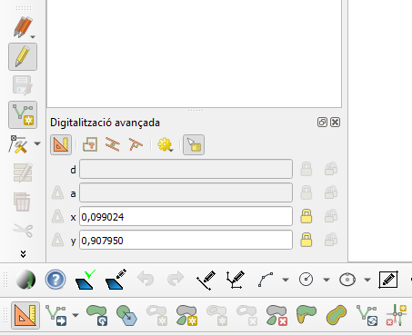
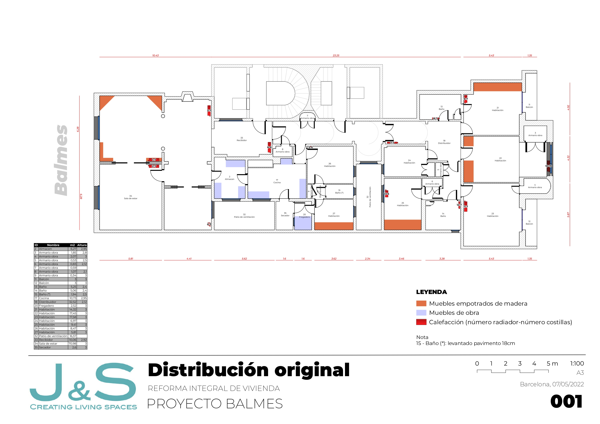
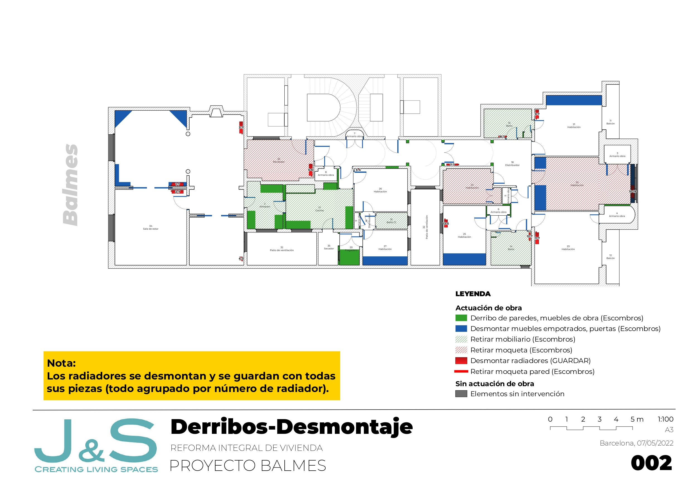
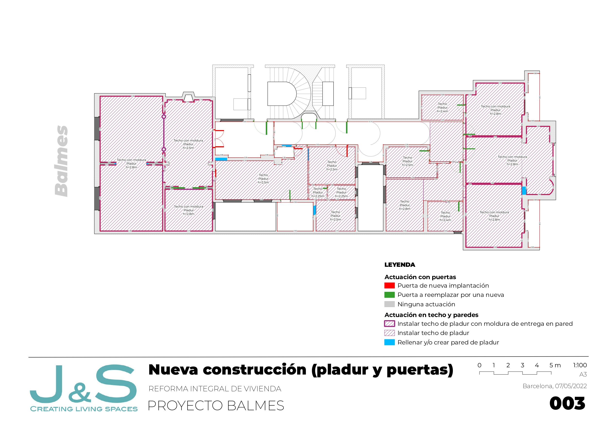
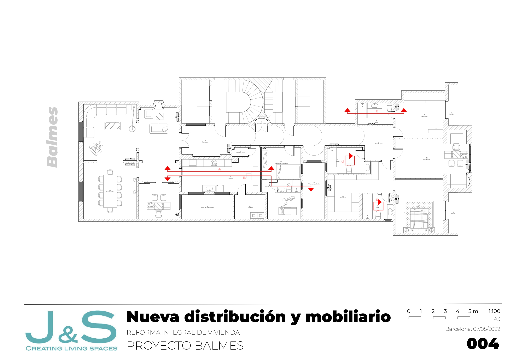
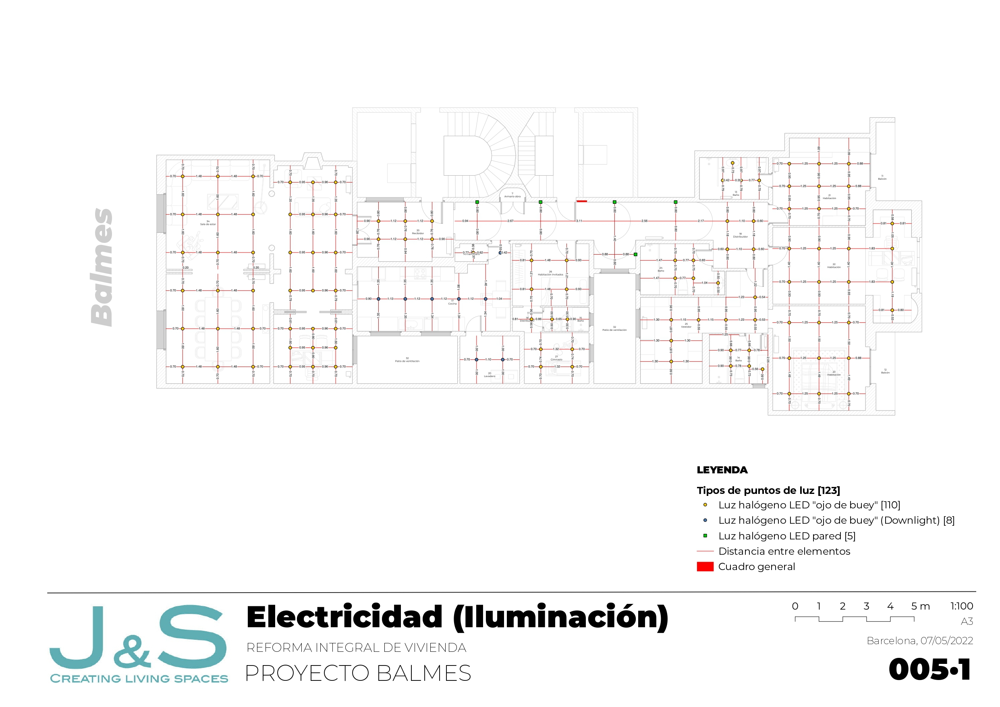
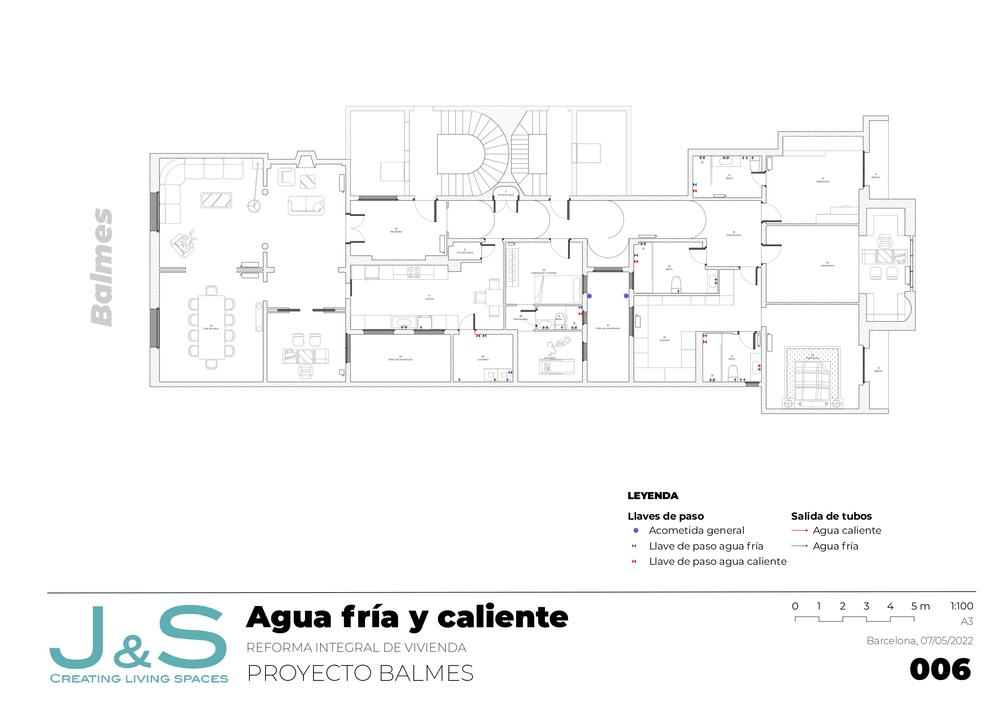
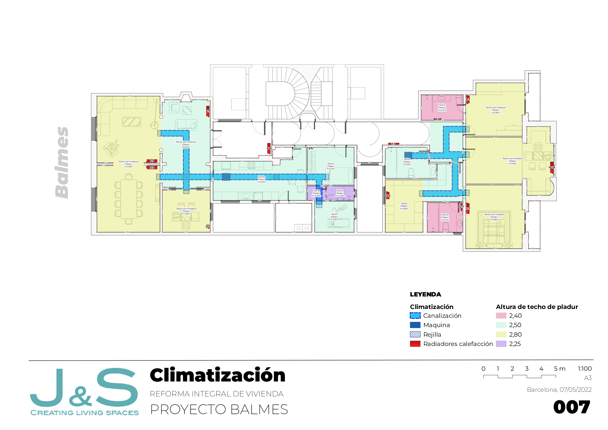
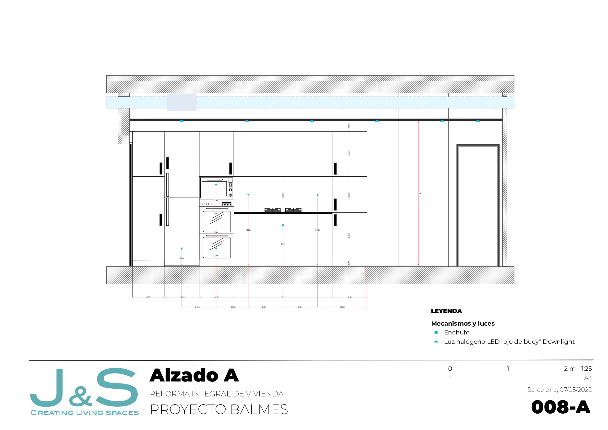

## Introducción

Un amigo gerente de una pequeña empresa de reforma de viviendas,
[jslivingspaces.com](https://jslivingspaces.com),
me ofreció hacer la documentación gráfica de un piso de grandes
dimensiones -350 m2- de Barcelona. Esto incluía los planos del estado
actual y los que necesitan los industriales para realizar la reforma:
derribos, nueva construcción, nueva distribución, mobiliario,
carpintería de madera, carpintería de aluminio, electricidad, agua,
climatización y alzados de cocina y baños.

En ese momento me encontraba huérfano de Autocads y Microstations en mi
máquina virtual Windows bajo OSX y tampoco quería aventurarme con un CAD
de código abierto en mi Mac. Así que, como mi día a día es QGIS en todos
los trabajos que realizo en la administración pública y los de
desarrollo de mis productos, me dispuse a hacer todo el trabajo de
delineación con QGIS convirtiéndolo en un **Quantum Building Information System**

A continuación os explico mi experiencia con este trabajo.

## Sistema de referencia

El software CAD devuelve el diseño de sus elementos en una interfície
ortogonal y perfectamente plana. QGIS devuelve sus elementos en una
interfície que simula la curvatura de la tierra gracias a la asignación
de los sistemas de referencia y sus proyecciónes. Esto hace que se
dibuje el objeto con una deformación[1] que no es correcta para la
arquitectura. Por este motivo establecí `NO CRS`, _unknown/non-Earth projection_,
para digitalizar elementos planos como en CAD.

[1]:"Cabe decir que la diferencia de longitud de una misma línea medida en cota cartesiana (sin CRS) o cota geográfica (con CRS ETRS89 UTM 31N) es de 3cm."

## Herramientas de delineación

QGIS aporta herramientas de deliniación que vienen instaladas de origen.
A éstas les acompaña un soporte avanzado de digitalización (Imagen 1).
Éstas herramientas permiten hacer todas las operaciones de dibujo pero
QGIS permite además añadir más herramientas mediante sus plugins.

Para digitalizar elementos, el plugin [QAD](https://plugins.qgis.org/plugins/qad/) será útil aunque se cuelga y desobedece si se le atosiga con un seguido cambio de datos a insertar.
Cuándo esto sucede, no se necesita cerrar y abrir de nuevo el programa,
sino que con continuar digitalizando con la herramienta de origen será
suficiente. Esto le da un respiro y se recupera para poder volver a
dibujar sin devolver ningún error. Es como si se arreglara él solo.

## Opciones de ajuste

Las opciones de ajuste, llamados también encages (snaps en CAD) son de
vital importancia. Si cuatro líneas no encajan y no cierran, no puedes
crear un polígono. El snap del plugin QAD da muchos errores y no encaja
los elementos ni ajustando sus settings.

Para que no recaigan cientos de errores de una sola vez, lo mejor es
verificar la topologia cada 10-15 minutos mientras de digitaliza.

## Atributos de elemento y GroupState

Una buena asignación de atributos y datos permitirá hacer con GroupState
una explotación numérica y alfanumérica eficiente, correcta y valiosa de
nuestros elementos digitalizados. Con ello podremos crear la
documentación escrita del proyecto: memorias, presupuestos, listados de
material, mediciones.

Ejemplos de tablas:

### Línea (cable electricidad)

**ID**   | **Length**   | **Material**   | **Proveedor**   | **mm2**   | **Amp**   | **Altura-h**   | **Altura-z**   | **€/m**
-------- | ------------ | -------------- | --------------- | --------- | --------- | -------------- | -------------- | ---------
1        | 25,2         | Cobre          | Electro, S.A    | 2,5       | 4         | 1,65           | 168,85         | 1,55
2        | 35,8         | Oro            | Electro, S.A    | 3         | 15        | 2              | 170,85         | 30
...      | ...          | ...            | ...             | ...       | ...       | ...            | ...            | ...

### Polígono (pladur)

**ID**   | **Length**   | **Width**   | **Material**   | **Proveedor**   | **m2**   | **Altura-h**   | **Altura-z**   | **gr/m2**   | **€/m2**
-------- | ------------ | ----------- | -------------- | --------------- | -------- | -------------- | -------------- | ----------- | ----------
1        | 5,2          | 3,5         | Cobre          | Calefacta, S.A  | 18,2     | 2,20           | 172,00         | 2.500       | 22
2        | 3,5          | 2           | Cobre          | Calefacta, S.A  | 7        | 2,20           | 172,00         | 2.500       | 22
...      | ...          | ...         | ...            | ...             | ...      | ...            | ...            | ...         | ...

### Punto (punto de luz, mecanismos)

**ID**        | **Tipo**      | **Proveedor**   | **Amp**   | **Altura-h**   | **€/unit**
------------- | ------------- | --------------- | --------- | -------------- | -------------
1             | Enchufe 10A   | Calefacta, S.A  | 10        | 0,65           | 3,00
2             | Enchufe 25A   | Calefacta, S.A  | 25        | 0,95           | 5,00
...           | ...           | ...             | ...       | ...            | ...

## Elementos SVG

Los planos de electricidad se expresan con un grafismo específico. QGIS
no dispone de éste grafismo y por lo tanto se debe crear desde cero. En
mi caso utilizé el software libre [inkscape](https://inkscape.org/es/).
Debo perfeccionarlos en su grueso y añadir elementos para ampliar leyendas.

## Vistas guardadas y Atlas

¡Qué fácil es editar los planos con las vistas guardadas y Atlas!

Ten presente que para cada plano es necesario crear su grupo de capas
con las respectivas capas necesarias y a la vez salvar su vista para
después poderla aplicar al Atlas con el plano correspondiente. Si llevas
un buen orden de capas y de su nomenclatura verás que es de una alta
eficiencia.

**QGIS es un software con una versatilidad abrumadora**. Es una mezcla de
CAD, Acces y Photoshop. La persona que crea que solo sirve para la
geografía, va muy errada. A todo delineante u otro profesional que tenga
conocimientos de QGIS le animo a probar su uso con la arquitectura.

## Resultados

Aquí tenéis los resultados:

