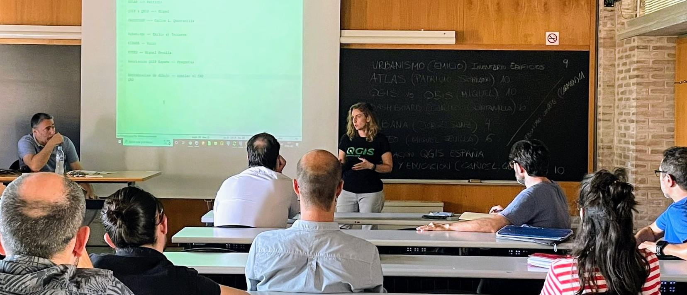
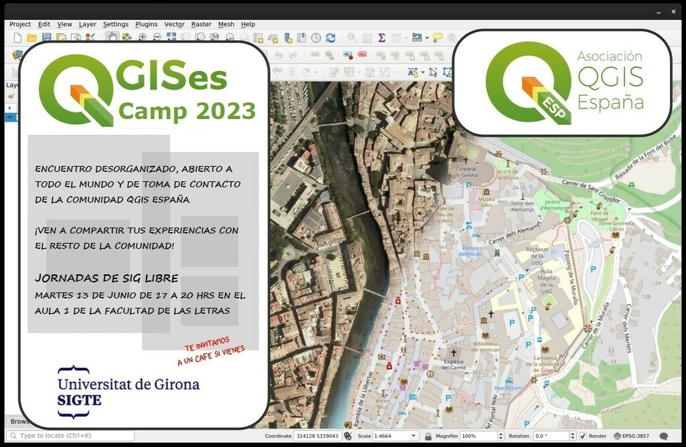

Las [Jornadas de SIG Libre de Girona](https://www.jornadassiglibre.org/) son uno de los eventos anuales de referencia sobre tecnologías geoespaciales y ciencia de datos espaciales que se realizan en España. Organizadas por el Servicio de SIG y Teledetección (SIGTE) de la Universitat de Girona las Jornadas [#siglibre2023](https://twitter.com/search?q=%23siglibre2023) se celebrarán este año los próximos días 14 y 15 de junio en la Facultat de Lletres i de Turisme de la Universitat de Girona.

Este año, aprovechando de nuevo esta cita de eventos, desde la Asociación vamos a celebrar nuestro 2º Reunión anual el día previo (13 de junio) al inicio de las Jornadas SIG Libre de Girona.

Queremos desde aquí agradecer la colaboración que el SIGTE nos presta para la organización y difusión del evento.

## ¿Cómo está organizado?

El evento está organizado como una **“des-conferencia”**, esto significa que no hay un programa cerrado. Si quieres dar a conocer un caso de uso de QGIS de tu empresa u organización o crees que puedes hacer una sesión sobre alguna de las múltiples funcionalidades de este SIG abierto simplemente vente al evento y preséntalo. 

El objetivo principal es hacer comunidad y  compartir las experiencias de usuarios y desarrolladores de QGIS con el resto de los usuarios.

Aprovecharemos también  para hacer presentación de la Asociación para las personas no asociadas y recopilar ideas y propuestas a futuro tanto para QGIS como para la Asociación.

## Fecha, hora y lugar de celebración.

Nos veremos el 13 de junio de 2023 de 17h a 20h en el aula A1 de la Facultad de Letras de la Universidad de Girona. 

<iframe width="90%" height="350" frameborder="0" scrolling="no" marginheight="0" marginwidth="0" src="https://www.openstreetmap.org/export/embed.html?bbox=2.8265307018638235%2C41.983946337495745%2C2.829215593087731%2C41.98535990653521&amp;layer=mapnik&amp;marker=41.98465312593855%2C2.8278731474757706" style="border: 1px solid black"></iframe> <small><a href="https://www.openstreetmap.org/?mlat=41.98465&amp;mlon=2.82787#map=19/41.98465/2.82787">Ver mapa más grande</a></small>

Habrá un *coffee-break* a las 18h de unos 20 minutos.

## Coste/Inscripción

Se trata de un **evento abierto y gratuito**. No es necesario hacer prescripción. 

Además tenemos “regalitos” 🎁 para los asistentes.

## Ayúdanos a difundir la #QGISesCamp 2023

Aquí os dejamos enlaces a nuestras redes sociales y sitio web. Anímate a compartir.

- Página web: [https://www.qgis.es](https://www.qgis.es)
- Twitter: [https://twitter.com/qgises](https://twitter.com/qgises)
- Etiqueta [#QGISesCamp](https://twitter.com/search?q=%23QGISesCamp)
- Instagram: [https://www.instagram.com/qgises/](https://www.instagram.com/qgises/)

