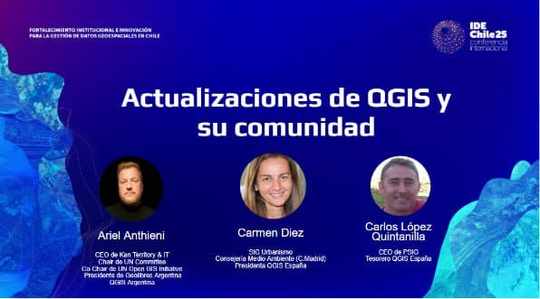
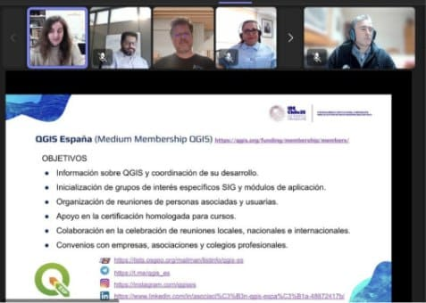

Esta charla forma parte de una serie de eventos geoespaciales que se desarrollan dentro de la *Semana Geoespacial* y son previas a la conferencia **IDE (Infraestructura de Datos Geoespaciales) de Chile**, que se celebrará el **4 de noviembre de 2025**. 

Este webinar, en el que participaron casi sesenta (60) asistentes, fue impartido por [Ariel Anthieni](https://kan.com.ar/), CEO de Kan Territory & IT y presidente de [Geolibres Argentina](https://geolibres.org.ar/), junto con **Carmen Díez**, Técnica SIG de Urbanismo, y **Carlos López Quintanilla**, CEO de PSIG, ambos pertenecientes a la junta directiva de la [Asociación QGIS España](https://www.qgis.es/), encargados de la Presidencia y Tesorería, respectivamente.

---

  
   
  <em>Participantes de la charla virtual IDE Chile (fuente: Asociación QGIS España).</em>

---

Tras la presentación de la agenda y los objetivos de la charla, centrada en las actualizaciones de QGIS y su comunidad, se habló sobre la creación y contribución al proyecto QGIS, tanto de la Asociación QGIS España como de QGIS Argentina, y se mencionó cómo colaborar con sus comunidades de usuarios y desarrolladores. 

También se abordó el tema del *roadmap* entre QGIS 3 y QGIS 4, y se realizó una demostración en vivo del uso de QGIS con datos de la IDE Chile, incluyendo actuaciones como: cargar capas, simbolizar, etiquetar, seleccionar por expresión, hacer composiciones y geoprocesos, y utilizar complementos.

---

  
   
  <em>Demostración práctica con datos de la IDE Chile en QGIS (fuente: Asociación QGIS España).</em>

---

Se puede acceder tanto al [vídeo de la charla virtual](https://www.youtube.com/@IDECHILEMBN/videos), disponible en el canal de YouTube de IDE Chile, como a la [presentación](https://cloud.montera34.org/index.php/s/EgfjHPAqBWNxkkD) alojada en la plataforma de la Asociación QGIS España.  

En ellos puedes encontrar información sobre la creación de la Asociación QGIS España en 2018 para apoyar el desarrollo de QGIS, que ahora cuenta con casi 100 miembros, incluyendo numerosas grandes y pequeñas empresas, y cómo contribuye económica y técnicamente al proyecto QGIS.  

Se destaca la importancia de la divulgación del uso de QGIS y la resolución de dudas de los usuarios, mencionándose la posibilidad de asociarse a través del [formulario de inscripción](https://cloud.montera34.org/index.php/apps/forms/s/FQqsZL6atPQworeJjMzmRqpP) en su web.  

También se ofrece información sobre objetivos, estatutos y cómo contactar con la Asociación y colaborar con QGIS:

- [Canal de Telegram de QGIS en español](https://t.me/qgis_es)
- [Repositorio de código de QGIS](https://github.com/qgis/QGIS)
- [Notificación de errores o propuestas de mejora](https://github.com/qgis/QGIS/issues)
- [Certificaciones de formación de QGIS](https://www.qgis.org/community/certification/)
- [Plataforma de certificación](https://certification.qgis.org/en/)

---

