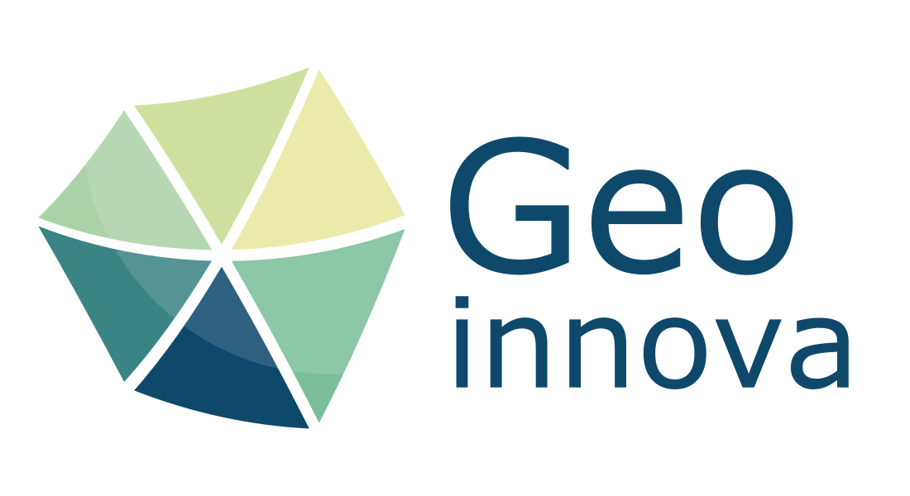
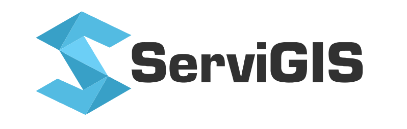
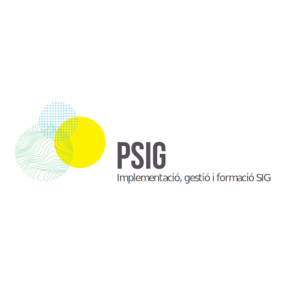
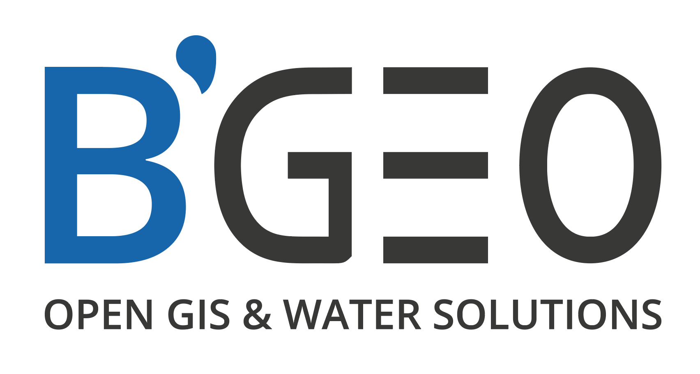
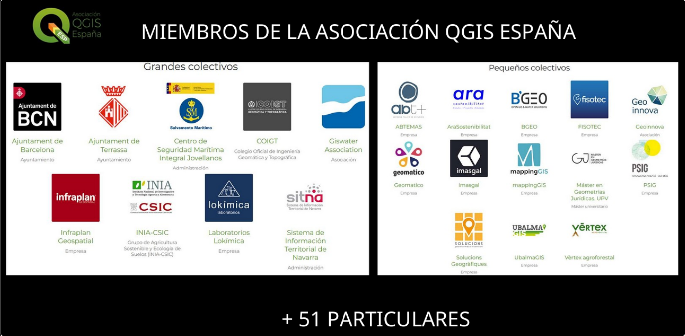

# UN DÍA PARA COMPARTIR QGIS
## (Asociación QGIS España)

Nuestra **QGISesCamp2026** se ha celebrado finalmente en Madrid el pasado sábado 13 de junio de 2026.

El evento ha contado con la participación de más de sesenta personas (un 28% de mujeres): cincuenta y ocho provenientes de diversos lugares como Salamanca, Granada, Córdoba, Santander, Barcelona, Murcia, Valencia, Málaga o Pamplona, además de Madrid, y tres personas asistiendo de manera remota.

Este encuentro presencial para compartir conocimiento, experiencias y proyectos alrededor de QGIS, el software libre GIS y sus comunidades, ha sido posible gracias al esfuerzo de organizadores, patrocinadores, ponentes y asistentes, que han participado, tanto individualmente, como en representación de las empresas e instituciones que han colaborado: La Escuela Técnica Superior de Ingeniería Agronómica, Alimentaria y de Biosistemas (ETSIAAB – UPM), el Centro de Innovación en Tecnología para el Desarrollo (itdUPM), la Asociación QGIS España, el grupoo de Geoinquietos Madrid, y los patrocinadores.

  
  
  
  

  
  
  
  
  
        

Mucho más que un evento, la **QGISesCamp2026** ha sido un punto de encuentro donde la comunidad QGIS ha podido intercambiar experiencias, generar oportunidades e impulsar el conocimiento de un software libre funcional y reconocido, todo ello de una manera informal, participativa y relajada, con el acompañamiento en todo momento de un servicio de catering inmaculado, profesional y completo, a cargo de **Subiendo al Sur**, cuyos coffee breaks y almuerzo, nos recargaron de energía a lo largo de todo el día.

Su formato informal, practico y participativo, con un track único de charlas, talleres, lighting talks y una desconferencia final, han permitido que toda la comunidad comparta sus experiencias de forma conjunta. Las actividades a lo largo de la jornada que se desarrollaron tanto en el edificio de aulas de la ETSI de Agrónomos como en el ITD de la Universidad Politécnica de Madrid, siguieron el programa previsto contando con las exposiciones de: Cristina Velilla y Miguel Marchamalo, de la UPM; Carmen Díez, de la Asociación QGIS España; Luis Quesada, de QGISes y Geoinnova; Víctor Olaya, de Geoinquietos Madrid; Patricio Soriano, de Geoinnova; Ariel Anthieni, de Kan Territory & IT; Jesús García, de ServiGIS; Nerea Arribas, de INECO; y Antonio M. Moreno, de la Diputación de Córdoba. Siguiendo con la participación de: Carlos López, de PSIG; Rodrigo Saz-Orozco, de MITECO; y Alberto Soneira, de QGISes. Todas sus presentaciones las podéis encontrar [en la página del evento.](https://www.qgis.es/talk/2026-05-qgis-camp-espana-2026-madrid/)

Nuestro mayor agradecimiento a las entidades con las que hemos podido contar durante nuestra celebración anual y que ya forman parte de nuestra comunidad QGIS, y también y de forma muy especial, a todas las personas y entidades asociadas que creen en el software libre y los datos abiertos, apoyando, al formar parte de la Asociación QGIS España, al desarrollo de QGIS.

GRACIAS
¡HASTA EL AÑO QUE VIENE!
