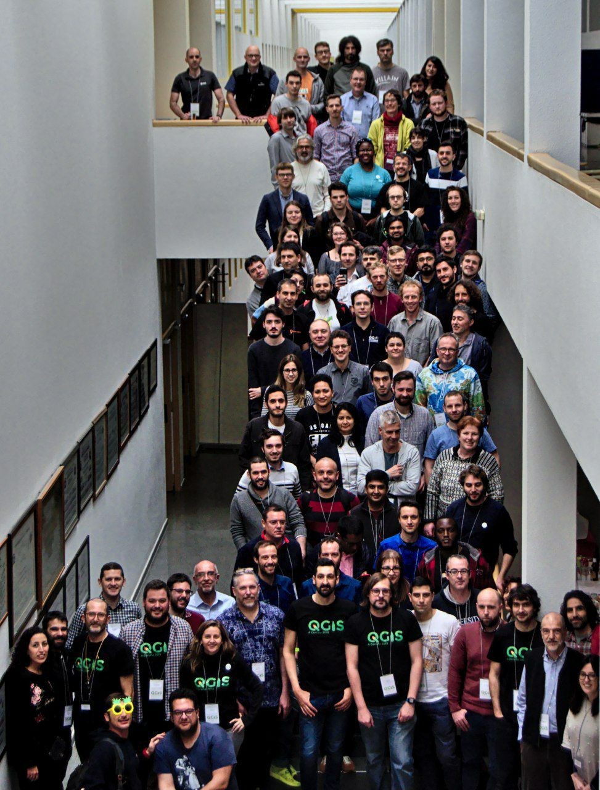

- [International QGIS User Conference](#international-qgis-user-conference)
  * [Financial report](#financial-report)
  * [Video recordings](#video-recordings)
  * [QGIS Developer Meeting](#qgis-developer-meeting)
  * [Code of conduct](#code-of-conduct)
  * [Period and location](#period-and-location)
  * [Organizers](#organizers)
  * [Contact](#contact)
  * [Venue](#venue)
  * [Sponsors](#sponsors)
  * [Program](#program)
  * [Accommodation](#accommodation)
  * [Transportation. How to arrive](#transportation-how-to-arrive)
    + [By air](#by-air)
    + [By Train](#by-train)
    + [By Bus](#by-bus)
  * [Register](#register)
  * [Individual Preparation](#individual-preparation)
- [Tourist/Sport/Cultural activities](#touristsportcultural-activities)
  * [Carnival](#carnival)
  * [General](#general)
  * [Touristic walk (Managed by Municipality)](#touristic-walk-managed-by-municipality)
  * [Run/Walk/Bike/Swim/Paddle/Surf](#runwalkbikeswimpaddlesurf)
    + [Surf season](#surf-season-managed-by-micho-garcia)
  * [Sauna/Swimming Pools/SPAs](#saunawhimming-poolsspas)
  * [Family facilities](#family-facilities)
    + [For children and babies](#for-children-and-babies)
      - [Bebetecas](#bebetecas)
      - [Parks](#parks)
  * [FAQ](#faq)



# International QGIS User Conference

Link to official page http://2019.qgis.es/

The International QGIS User and Developer Conference wants to be the referential conference, and a meeting point for the family of users and developers orbiting around the QGIS project, in order to gather experiences and sharing knowledge about QGIS. The language of the Conference is English.

Remember is Carnival. Dress yourself as a real galician e.g. something remembering QGIS colors green and yellow.

## Financial report

Final [financial report](https://docs.google.com/document/d/1XMZsyP5mEE4ZKdCbd4YXx1wptkmGitZFjZ6cfvw8Hmo/edit) of the Conference and Hackmeeting

## Video recordings

Conference videos can be found at [av.tib.eu](https://av.tib.eu/series/630/qgis+acoruna+konferenz+2019) portal:

## QGIS Developer Meeting

A QGIS Developer Meeting is a volunteer-driven event where contributors to the QGIS project from around the world get together in a common space - usually a university campus.

more details [here](https://github.com/qgis/QGIS/wiki/22nd-Developer-Meeting-in-A-Coruña%2C-Spain)

## Code of conduct

When attending our meetings we ask you to please abide by the QGIS [diversity statement](https://qgis.org/en/site/getinvolved/governance/codeofconduct/diversitystatement.html) and [Code of Conduct](https://qgis.org/en/site/getinvolved/governance/codeofconduct/codeofconduct.html). We also ask attendees to respect local laws, customs and culture and be good ambassadors for the QGIS project.

## Period and location

* The user conference will take place from 04 to 06 of March, 2019.

## Organizers

* Luigi Pirelli luipir@gmail.com 
* Francisco Pérez Sampayo fpsampayo@gmail.com
* Carlos López Quintanilla carlos.psig@gmail.com
* Carmen Díez Sanmartín carmen10maica@gmail.com
* Francisco Raga López franka1986@gmail.com
* David Fernández Arango davidfernandezarango@hotmail.com

(Volunteers)
* Pablo Sanxiao psanxiao@gmail.com
* Brais Arias braisarias@gmail.com
* Xan Vieiro gallaecia6@gmail.com
* Micho García michogar@gmail.com
* David Pereira dvdpermar@gmail.com
* Adrian adrianet82@gmail.com

## Contact

* **General Info userconf2019@qgis.es**
* Luigi Pirelli luipir@gmail.com

## Venue

* Workshops [Scientific Area Building - UDC](https://www.udc.es/en/sobreUDC/localizacion/corunha/elvinha/area_cientifica/) - [OSM](https://www.openstreetmap.org/#map=18/43.33305/-8.40921) - [OSM Building](https://www.openstreetmap.org/way/266431150)

* User Conference [E.T.S. Ingeniería de Caminos, Canales y Puertos](http://caminos.udc.es) - [OSM](https://www.openstreetmap.org/?mlat=43.33348&mlon=-8.40961#map=19/43.33348/-8.40961)

  _It is little far from the center of the city but there is a bus line [UDC line](https://moovitapp.com/index/es/transporte_p%C3%BAblico-line-UDC-A_Coruna-2580-851741-529702-2025978) that it take daily to the university area from the Pontevedra Square. The duration of the trip is about 30 minutes._

## Collaborators

* [QGIS.ORG](http://www.qgis.org)
* [qgis.es](http://qgis.es)
* [Xeoinquedos](https://xeoinquedos.wordpress.com/)
* [Concello e A Coruña](https://www.coruna.gal)
* [OSGeo](https://www.osgeo.org)
* [Universidade da Coruña](https://www.udc.es)
* [ETS de Caminos, Canales y Puertos](http://caminos.udc.es)
* [cartolab](http://cartolab.udc.es/cartoweb)

## Sponsors

* [Lutra Consulting](http://www.lutraconsulting.co.uk)
* [Geographica](https://geographica.gs/es/)
* [DotGis](http://www.dotgiscorp.com)
* [ServiGIS](http://www.servigis.com/)
* [Geoinnova](https://geoinnova.org)
* [MappingGIS](https://mappinggis.com/)
* [FISOTEC](https://www.fisotec.es/)
* [UNIGIS](https://unigis.net/)
* [NexusGeographics](https://www.nexusgeographics.com/)
* [BGEO](http://www.bgeo.es/)
* [iCarto](http://icarto.es/)
* [BGEO OPEN GIS](http://www.bgeo.es/)
* [PROYESTEGAL](http://www.proyestegal.com/)
* [INGENIERIA INSITU](https://ingenieriainsitu.com/)
* [GPUL](https://gpul.org/)

## Program

Remember is Carnival. Dress yourself as a real galician e.g. something remembering QGIS colors green and yellow.

* UserConference web page: [2019.qgis.es](http://2019.qgis.es)
* Wokshops and demos [timetable](https://docs.google.com/spreadsheets/d/1jscFi1QmcaaHmc6XmvbKMXkg9vWyQ8OttmMnkC9QLr0/edit#gid=1528479278)
* [Track 1](https://docs.google.com/spreadsheets/d/1jscFi1QmcaaHmc6XmvbKMXkg9vWyQ8OttmMnkC9QLr0/edit#gid=1257947789)
* [Track 2](https://docs.google.com/spreadsheets/d/1jscFi1QmcaaHmc6XmvbKMXkg9vWyQ8OttmMnkC9QLr0/edit#gid=2133168314)

Talks [details](https://docs.google.com/spreadsheets/d/1jscFi1QmcaaHmc6XmvbKMXkg9vWyQ8OttmMnkC9QLr0/edit#gid=0)
Workshop and demos [details](https://docs.google.com/spreadsheets/d/1jscFi1QmcaaHmc6XmvbKMXkg9vWyQ8OttmMnkC9QLr0/edit#gid=1137589810)

## Accommodation

We weren't able to find convenient collective agreement with hotels. Our suggestion is to book using the common web platforms. 

We can recommend these accommodations for their quality / price ratio and if you book through this ['Booking.com' link](https://www.booking.com/s/11_6/7d8c1671), you will receive a refund of €15 after your stay:

* [Pensión Las Rías](https://www.booking.com/hotel/es/pensia3n-las-rias.es.html?aid=304142;label=gen173bo-1DCAEoggI46AdIM1gDaEaIAQGYAQq4AQjIAQzYAQPoAQH4AQWIAgGYAgSoAgM;sid=772c496feac3bcbb97a7c1f8d9e9c09d;atlas_src=sr_iw_btn;checkin=2019-03-03;checkout=2019-03-10;dist=0;group_adults=2;nflt=pri%3D1%3Boos%3D1%3Bfc%3D2%3Bhotelfacility%3D107%3B;room1=A%2CA;sb_price_type=total;type=total;ucfs=1&#map_closed). Doble rooms about €30/night approx.

* [Hostal Roma](https://www.booking.com/hotel/es/pensia3n-roma.es.html?aid=318615;label=New_English_EN_ALL-GBIECAUS_5226333385-zrfE0CU6K_HWeoloJw%2APrQS46932911785%3Apl%3Ata%3Ap1%3Ap2%3Aac%3Aap1t1%3Aneg;sid=233f10bae74766e2fc6a512a35f9cb76;all_sr_blocks=42267604_115184523_0_2_0;checkin=2019-03-03;checkout=2019-03-10;dest_id=-386792;dest_type=city;dist=0;group_adults=2;hapos=10;highlighted_blocks=42267604_115184523_0_2_0;hpos=10;nflt=hotelfacility%3D107%3Bfc%3D2%3Bpri%3D1%3B;room1=A%2CA;sb_price_type=total;sr_order=popularity;srepoch=1547811029;srpvid=c6af50eac2730234;type=total;ucfs=1&#hotelTmpl). Doble rooms about €46/night approx.

* [Hotel Riazor](https://www.booking.com/hotel/es/riazor.es.html?aid=304142;label=gen173bo-1DCAEoggI46AdIM1gDaEaIAQGYAQq4AQjIAQzYAQPoAQH4AQWIAgGYAgSoAgM;sid=772c496feac3bcbb97a7c1f8d9e9c09d;atlas_src=sr_iw_btn;checkin=2019-03-03;checkout=2019-03-10;dist=0;group_adults=2;nflt=pri%3D3%3Boos%3D1%3Bfc%3D2%3Bhotelfacility%3D107%3B;room1=A%2CA;sb_price_type=total;type=total;ucfs=1&). Doble rooms about €70/night approx.

* [Hotel Blue Coruña](https://www.booking.com/hotel/es/blue-coruaa.es.html?aid=304142;label=gen173bo-1DCAEoggI46AdIM1gDaEaIAQGYAQq4AQjIAQzYAQPoAQH4AQWIAgGYAgSoAgM;sid=772c496feac3bcbb97a7c1f8d9e9c09d;atlas_src=sr_iw_btn;checkin=2019-03-03;checkout=2019-03-10;dist=0;group_adults=2;nflt=pri%3D3%3Boos%3D1%3Bfc%3D2%3Bhotelfacility%3D107%3B;room1=A%2CA;sb_price_type=total;type=total;ucfs=1&). Doble rooms about €80/night approx.

* [Hotel Nido](https://www.booking.com/hotel/es/nido.es.html?aid=304142;label=gen173bo-1DCAEoggI46AdIM1gDaEaIAQGYAQq4AQjIAQzYAQPoAQH4AQWIAgGYAgSoAgM;sid=772c496feac3bcbb97a7c1f8d9e9c09d;atlas_src=sr_iw_btn;checkin=2019-03-03;checkout=2019-03-10;dist=0;group_adults=4;group_children=0;nflt=pri%3D1%3B;no_rooms=1;room1=A%2CA%2CA%2CA;sb_price_type=total;type=total;ucfs=1&). Triple rooms about €60/night approx.

* [Hostal La Provinciana](https://www.booking.com/hotel/es/hostal-la-provinciana.es.html?aid=304142;label=gen173bo-1DCAEoggI46AdIM1gDaEaIAQGYAQq4AQjIAQzYAQPoAQH4AQWIAgGYAgSoAgM;sid=772c496feac3bcbb97a7c1f8d9e9c09d;atlas_src=sr_iw_btn;checkin=2019-03-03;checkout=2019-03-10;dist=0;group_adults=4;group_children=0;nflt=pri%3D2%3B;no_rooms=1;room1=A%2CA%2CA%2CA;sb_price_type=total;type=total;ucfs=1&). Triple rooms about €70/night approx.

* [Hotel Riazor](https://www.booking.com/hotel/es/riazor.es.html?aid=304142;label=gen173bo-1DCAEoggI46AdIM1gDaEaIAQGYAQq4AQjIAQzYAQPoAQH4AQWIAgGYAgSoAgM;sid=772c496feac3bcbb97a7c1f8d9e9c09d;atlas_src=sr_iw_btn;checkin=2019-03-03;checkout=2019-03-10;dist=0;group_adults=4;group_children=0;nflt=pri%3D2%3B;no_rooms=1;room1=A%2CA%2CA%2CA;sb_price_type=total;type=total;ucfs=1&). Triple rooms about €100/night approx.

* [Hotel Avenida](https://www.booking.com/hotel/es/avenida-la-coruna.es.html?aid=376363;label=booking-name-L%2AXf2U1sq4%2AGEkIwcLOALQS267777916054%3Apl%3Ata%3Ap1%3Ap22%2C208%2C000%3Aac%3Aap1t1%3Aneg%3Afi%3Atiaud-294889296613%3Akwd-65526620%3Alp9061032%3Ali%3Adec%3Adm;sid=199452e91a27b6ff7f3634023ffe006c;all_sr_blocks=9359316_129846591_0_2_0;checkin=2019-03-03;checkout=2019-03-10;dest_id=-386792;dest_type=city;dist=0;group_adults=4;group_children=0;hapos=3;highlighted_blocks=9359316_129846591_0_2_0;hpos=3;map=1;nflt=hotelfacility%3D107%3Bfc%3D2%3Bpri%3D1%3Boos%3D1%3B;no_rooms=1;req_adults=4;req_children=0;room1=A%2CA%2CA%2CA;sb_price_type=total;sr_order=popularity;srepoch=1547663986;srpvid=e5688338af0f02ae;type=total;ucfs=1&#map_closed). Quadruple rooms about €70/night approx.

## Transportation. How to arrive

!!! IMPORTANT NOTE !!! Tuesday 5th is holiday in Spain (Carnival) you should take care that will be less buses from the Airport to the city center.
Who is attending workshops this day can use the UDC bus from city center that will have the normal holiday frequency (40') BUT at the start and the end of workshops.

Municipality reinforced the frequency at workshop start/stop with this timetable:

From "Plaza de Pontevedra" to university (Campus Elviña): 07:40 – 08:20 – 09:00 – 09:40

From University (Campus Elviña) to "Plaza de Pontevedra": 19:10 – 19:50

### By air

[how to get there](http://www.turismocoruna.com/web/corTurServer.php?idSecweb=165)

There are 3 airports in Galicia:

|Name|Code|Web|OpenStreetMap|
|-|-|-|-|
|Lavacolla|**SCQ**|[link](http://www.aena.es/es/aeropuerto-santiago/index.html)|[OSM](https://www.openstreetmap.org/?mlat=42.89188&mlon=-8.42091#map=17/42.89188/-8.42091)|
|Alvedro|**LCG**|[link](http://www.aena.es/es/aeropuerto-a-coruna/index.html)|[OSM](https://www.openstreetmap.org/?mlat=43.30222&mlon=-8.38145#map=18/43.30222/-8.38145)|
|Peinador|**VGO**|[link](http://www.aena.es/es/aeropuerto-vigo/index.html)|[OSM](https://www.openstreetmap.org/?mlat=42.22521&mlon=-8.63271#map=17/42.22521/-8.63271)|

From Alvedro airport (A Coruña) a direct and cheap bus reach the city center stopping near central train station and bus station just at the beginning of the city center.

From Lavacolla international airport (Santiago de Compostela) it's necessary to go to train or bus station to change and reach A Coruña.

From Peinador (Vigo) it's necessary to go to train or bus station to change and reach A Coruña.

Another international airport is:

|Name|Code|Web|OpenStreetMap|
|-|-|-|-|
|Oporto|**OPO**|[link](https://www.ana.pt/en/opo/departures)|[OSM](https://www.openstreetmap.org/search?query=oporto%20airport#map=17/-37.67183/144.84936)|

### By Train

See [Renfe](http://www.renfe.com/EN/viajeros/index.html) timetable

You can ask to the Conference organization the special Conference discount (30%) in RENFE tikets

### By Bus

See [Alsa](https://www.alsa.com/en/web/bus/home?gclid=CjwKCAiA99vhBRBnEiwAwpk-uAC5x2fPWUf89ExLcNOK4TPdpV4Hvu4N5h5_bQTiSE8kbm3m5bJ_1hoCcxkQAvD_BwE) timetable.

## Register

Register using the conference home page

## Individual Preparation 

* Bring your own computer (and power supply!). Power socket etc. and obviously QGIS installed

# Tourist/Sport/Cultural activities

## Carnival

The "Entroido" is the Galician terms for Carnival. As soon as we have the program in A Coruña it will be linked in this page. BTW fix these dates:

* Tuesday 5th from 20:30 - Carnival parades during the night. Usually in Monte Alto from España square (city center)
* Wednesday 6th from 20:30 - "Entierro de la sardina" (Sardine funeral) funeral dancing parade from España square (city center) to "San Amaro" beach firing the "rey Bobo" (e.g. stupid king) and firing the Sardine.

## General

[Galicia touristic portal](http://www.turismo.gal/inicio?langId=en_US)

## Touristic walk (Managed by Municipality)

A walk to discover the history of the city. Tuesday 5th at 20:15 starting from Maria Pita square in front of the municipality. The guide offered by the administration will take 1.5h.

## Run/Walk/Bike/Swim/Paddle/Surf

### Surf season managed by [Micho Garcia](https://twitter.com/michogar)

If you plan to remain in A Coruña more days you can sign to the following activities

**Saturday, 9th March**

#### Baptism of initiation to the surf

The Bastiagueiro beach is one of the more common places to start practicing surf around A Coruña city, ideal for its soft and moderate waves for the initiation and improvement to surfing. It is located 15 minutes from the city of A Coruña and 10 minutes from the University.

Beach of Bastiagueiro, Oleiros, A Coruña. 

[Bastiagueiro, Turismo.gal](http://www.turismo.gal/recurso/-/detalle/10258/bastiagueiro?langId=es_ES&tp=3&ctre=15)

[Surf Forecast Bastiagueiro](http://www.surf-forecast.com/breaks/Playade-Bastiagueiros/forecasts/latest)

Helped by Prado Surf Escola [Bastiagueiro Center](https://pradosurfescola.com/escuela-surf-bastiagueiro/)

The activity includes:

- All necessary material: board, wetsuit, leash, lycra, and paraffin.

- Monitors qualified by the Spanish surfing federation.

- A ratio of 6 students per monitor.

- Displacement from the conference to the beach and from the beach to the hotel in the vehicles of the school.

- Liability and accident insurance

- Facilities on the beach with hot showers and space to leave the belongings of the participants.

Price of the activity: **35€ (up to 24 participants) or 30€ (from 25 to 50 participants)**. The activity will be paid during the same day.

#### Free surfing

It exists the possibility to rent surf material. 

Rentals: Board and wetsuit: **15 euros / 1 h or 20 euros / 2h**

**!!!IMPORTANT!!!!** : People who want to participate in the Baptism of Surfing

| # | Name | Surf Level (Experienced or Rookie) | Email |
| --- | --- | --- | --- | 
| **1** | Micho García | Experienced | michogar [at] gmail [dot] com |

For people who want to rent material and enjoy Free Surfing in the beautiful beaches from A Coruña, please keep in contact with me at **michogar [at] gmail [dot] com** with subject **[QGIS FREE SURFING]**

## Sauna/Whimming Pools/SPAs

There are many public swimming pools with a low fee entrance. You should only check if opened during Carnival days. Usually all public services can be closed the day 5th.
A private SPA service that have to be mentioned is the [Casa del Agua](https://termaria.es/). [Children](https://termaria.es/termaria-kids) older than three years old can enter only during weekend

## Family facilities

There are three scientific museums managed by the Municipality that should give a touristic pass for all the attenders. The museums are well managed and interactive giving a good activity for an afternoon with children and his parents.
More details at this [link](https://www.coruna.gal/mc2/es)

Other tech one is the Muncyt with workshops [agenda](http://www.muncyt.es/portal/site/MUNCYT/menuitem.bf4d937ac7211fe03b40824c01432ea0/?vgnextoid=9ec5e42baddea410VgnVCM1000001d04140aRCRD&lang_choosen=en)

Some Art museums are:
* [Museo das Bellas Artes](http://museobelasartescoruna.xunta.gal/index.php?id=434) 
* [Casa museo Maria Pita](https://www.coruna.gal/cultura/es/espacios/detalle-para-entidad/casa-museo-de-maria-pita/entidad/1149055946641?argIdioma=es)
* [Fundación Luis Soane](https://fundacionluisseoane.gal/gl/)

### For children and babies

[here](http://www.littlevigo.com/a-coruna-con-ninos/) a good resume, btw with more details...

#### Bebetecas

A Coruña is full of Public Libraries, most of them have "Bebeteca" that means spaces planned for children and babies. The most well organised one in the library inside the [Agora](https://www.coruna.gal/agora/es?argIdioma=es) civic center.
More info about public libraries and their cultural agenda is [here](https://www.coruna.gal/bibliotecas)

#### Parks

You can find many well organised parks with playgrounds oriented to baies or children. Some info can obtained [here](https://www.escapalandia.com/los-mejores-parques-infantiles-de-coruna/)

## FAQ 

* General mail info **userconf2019@qgis.es**
