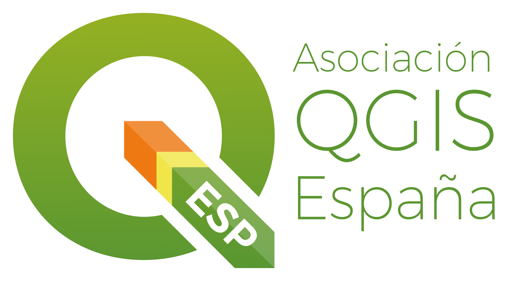
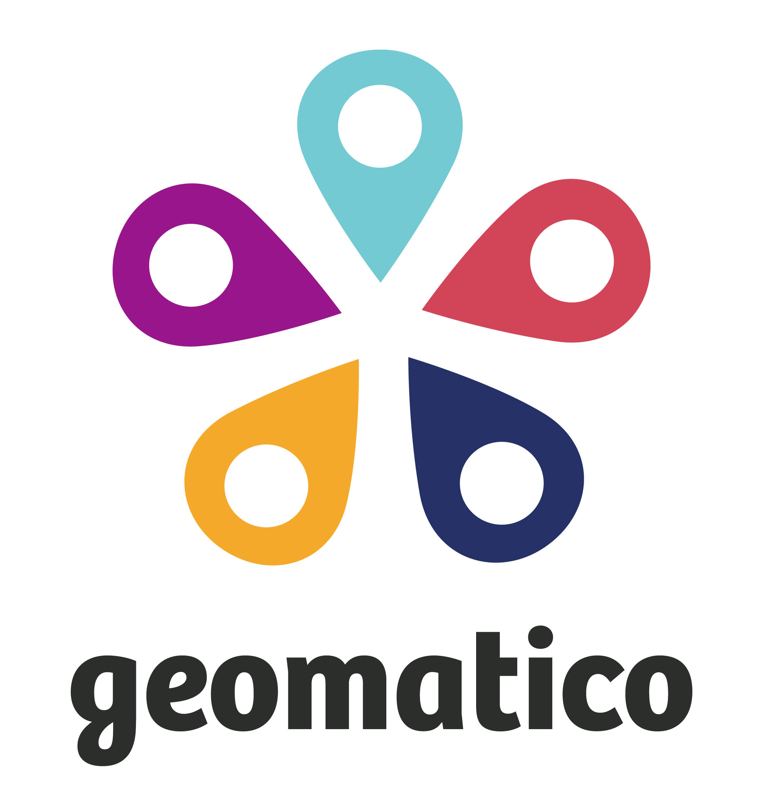
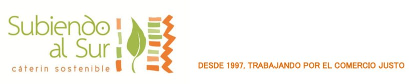

<h2>Presentaciones </h2>

<a href="./presentaciones/Formatos_y_Cajetines_como_Bloque_Virtual_en_QGIS-Antonio_Manuel_Moreno_García.pdf">Formatos y Cajetines como Bloque Virtual en QGIS - Antonio Manuel Moreno García</a>
<a href="./presentaciones/Modelos_BIM_vinculados_con_entidades_GIS-Nerea_Arribas.pdf">Modelos BIM vinculados con entidades GIS - Nerea Arribas</a>
<a href="./presentaciones/Novedades_QGIS_4_0-Luis_Quesada.pdf">Novedades QGIS 4.0 - Luis Quesada</a>
<a href="./presentaciones/Plugins_CAUMAX-Jesús_Garcia_Villar.pdf">Plugins CAUMAX - Jesús Garcia Villar</a>
<a href="./presentaciones/QField_Cloud_QGIS_en_la_palma_de_la_mano-Ariel_Anthieni.pdf">QField Cloud QGIS en la palma de la mano - Ariel Anthieni</a>
<a href="./presentaciones/Vibe_coding_para_QGIS_oportunidades_y_riesgos_de_crear_plugins_con_IA-Patricio_Soriano.pdf">Vibe coding para QGIS oportunidades y riesgos de crear plugins con IA - Patricio Soriano</a>

<h2>QGIS Camp España 2026 </h2>

Tras semanas de consulta y participación de la comunidad, la QGIS Camp España 2026 ya es una realidad: <strong>Madrid acogerá el encuentro el próximo 13 de junio de 2026</strong>, consolidándose como uno de los eventos de referencia para usuarios y desarrolladores de QGIS en España.

La decisión final se ha tomado a partir del proceso abierto de participación entre sedes candidatas, en el que la comunidad ha jugado un papel clave en la elección.

<h3>Lugar y horario</h3>

La jornada se desarrollará en dos espacios colindantes dentro de las instalaciones de la ETSIAAB – UPM:

<ul>

<li><strong><a href="https://maps.app.goo.gl/4sxw3rXBo1GUBr3N9" target="_blank">EDIFICIO DE AULAS E.T.S.I DE AGRÓNOMOS</a></strong></li>
<li><strong><a href="https://maps.app.goo.gl/Kv9d9G4UAes7Jhgq6" target="_blank">Centro de Innovación en Tecnología para el Desarrollo itdUPM</a></strong></li>

</ul>

<strong>Horario:</strong> de 9:00 a 20:00 h

<h3>Organizan</h3>

  
  
  
  

<h3>Patrocinan</h3>

  
  
  
  
  
        

<h3>Colaboran</h3>

<h3>Un encuentro abierto, práctico y colaborativo</h3>

La QGIS Camp mantiene su esencia: un evento informal, participativo y centrado en compartir conocimiento entre personas usuarias de QGIS de todos los niveles.

El formato será de <strong>track único</strong>, fomentando que toda la comunidad comparta la experiencia de forma conjunta.

<h3>Programa previsto</h3>

| Horario | Salon Presentaciones                                                                                               |
|---------|--------------------------------------------------------------------------------------------------------------------|
| 9:00    | Acreditación                                                                                                       |
| 10:00   | Bienvenida de la UPM (ITSI Agronómica) - Presentación de la Asociacion QGIS.es (Carmen Diez)                         |
| 10:20   | Novedades de QGIS 4.0 (Luis Quesada)                                                                               |
| 11:00   | Algunas reflexiones sobre QGIS en el contexto actual (Victor Olaya)                                                |
| 11:30   | ☕ Coffe Break                                                                                                        |
| 12:00   | Vibe coding para QGIS: oportunidades y riesgos de crear plugins con IA (Patricio Soriano)                          |
| 12:30   | QField Cloud: QGIS en la palma de la mano (Ariel Anthieni)                                                         |
| 13:00   | Plugins CAUMAX (Jesús Garcia Villar)                                                                               |
| 13:30   | Modelos BIM vinculados con entidades GIS para decisiones estratégicas basadas en análisis espacial (Nerea Arribas) |
| 13:30   | Formatos y Cajetines como "Bloque Virtual" en QGIS (Antonio Manuel Moreno García)                                  |
| 14:30   | 🍝 Almuerzo                                                                                                           |
| 16:00   | Lithing talk                                                                                                       |
| 16:30   | Organización Desconferencia                                                                                        |
| 17:00   | ☕ Coffe Break                                                                                                        |
| 18:00 - 20:00 | Desconferencia                                                                                                     |

<h3>Participa como ponente</h3>

Queremos construir el programa contigo. Si  quieres contarnos algo sobre QGIS apúntalo <a href="https://talks.osgeo.org/qgiscamp-es-2026/cfp" target="_blank">AQUÍ</a> con su título, resumen y duración: charla de 5 o 30 minutos. Tras la solicitud de inscripción, nos pondremos en contacto contigo.</strong>

Si tienes una experiencia, proyecto o idea que compartir, este es tu espacio.

<h3>Mucho más que un evento</h3>

La QGIS Camp España será también un punto de encuentro para:

<ul>

<li>Networking profesional</li>

<li>Intercambio de experiencias</li>

<li>Generación de oportunidades</li>

<li>Impulso del ecosistema QGIS en España</li>

</ul>

Además, contaremos con catering durante la jornada y espacios para la interacción informal entre participantes.

<h3>Inscripción</h3>

<strong>Las plazas son limitadas (aprox. 80 personas). INSCRIPCIONES CERRADAS por aforo completo. Gracias por la gran acogida!!</strong>

<h3>Patrocinio</h3>

QGIS Camp España 2026 es solo posible gracias al esfuerzo de las empresas e instituciones. Si estás interesado en patrocinar el evento puedes descargarte nuestra <a href="https://www.qgis.es/post/2026-05-13-qgis-es-camp-patrocinadores/Guia_Patrocinio_QGIS_Camp_Espana_2026_Madrid_final.pdf">guía para patrocinadores</a>

<h3>Organiza tu viaje y estancia</h3>

🚗🧳Si vienes desde fuera de Madrid y buscas alojamiento o personas con las que compartir el viaje, puedes encontrar y compartir información con el resto de participantes en<a href="https://cryptpad.fr/sheet/#/2/sheet/edit/EEOIlilgSQGMRwxwVOphx22N/embed/" target="_blank" rel="noopener noreferrer">
comparte tu viaje</a>

<h3>Próximas novedades</h3>

En las próximas semanas iremos anunciando el programa detallado, los ponentes confirmados y nuevas novedades sobre el evento.

<strong>¡Reserva la fecha y nos vemos en Madrid!</strong>

<!--ScriptorEndFragment-->

<!--EndFragment-->
