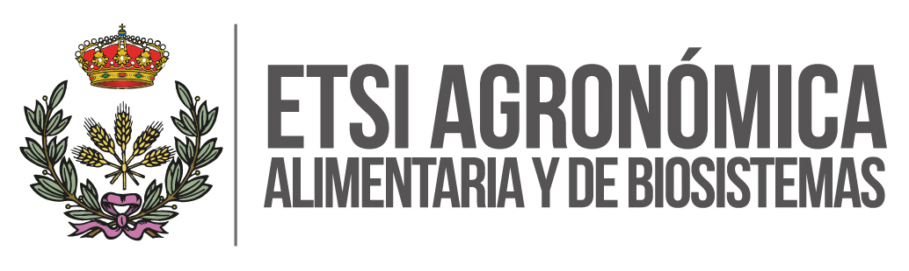
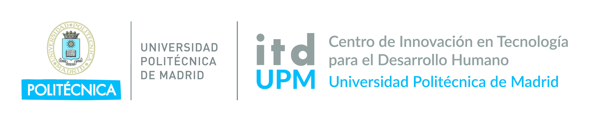

<!--StartFragment-->

<!--ScriptorStartFragment-->

<h2>QGIS Camp España 2026 </h2>

Tras semanas de consulta y participación de la comunidad, la QGIS Camp España 2026 ya es una realidad: <strong>Madrid acogerá el encuentro el próximo 13 de junio de 2026</strong>, consolidándose como uno de los eventos de referencia para usuarios y desarrolladores de QGIS en España.

La decisión final se ha tomado a partir del proceso abierto de participación entre sedes candidatas, en el que la comunidad ha jugado un papel clave en la elección.

<h3>Lugar y horario</h3>

La jornada se celebrará en:

<strong>Escuela Técnica Superior de Ingeniería Agronómica, Alimentaria y de Biosistemas (ETSIAAB – UPM)</strong> 

<a href="https://maps.app.goo.gl/ULQrEqhPFpiytC1w7?g_st=atm" target="_blank">Ver ubicación en Google Maps</a>

<strong>Horario:</strong> de 9:00 a 20:00 h

<h3>Patrocinan</h3>

  
  
  
  

<h3>Un encuentro abierto, práctico y colaborativo</h3>

La QGIS Camp mantiene su esencia: un evento informal, participativo y centrado en compartir conocimiento entre personas usuarias de QGIS de todos los niveles.

El formato será de <strong>track único</strong>, fomentando que toda la comunidad comparta la experiencia de forma conjunta.

<h3>Programa previsto</h3>

<h4>Mañana</h4>

<ul>

<li>09:00 Apertura y acreditación</li>

<li>10:00 Bienvenida oficial </li>

<li>Charlas y talleres prácticos sobre:</li>

<ul>

<li>QGIS 4.0</li>

<li>QField y QFieldCloud</li>

<li>Inteligencia Artificial aplicada a QGIS</li>

</ul>

</ul>

<h4>Tarde</h4>

<ul>

<li>Lightning Talks</li>

<li>Desconferencia (formato abierto y participativo)</li>

</ul>

<h3>Participa como ponente</h3>

Queremos construir el programa contigo. Si  quieres contarnos algo sobre QGIS apúntalo <a href="https://talks.osgeo.org/qgiscamp-es-2026/cfp" target="_blank">AQUÍ</a> con su título, resumen y duración: charla de 5 o 30 minutos. Tras la solicitud de inscripción, nos pondremos en contacto contigo.</strong>

Si tienes una experiencia, proyecto o idea que compartir, este es tu espacio.

<h3>Mucho más que un evento</h3>

La QGIS Camp España será también un punto de encuentro para:

<ul>

<li>Networking profesional</li>

<li>Intercambio de experiencias</li>

<li>Generación de oportunidades</li>

<li>Impulso del ecosistema QGIS en España</li>

</ul>

Además, contaremos con catering durante la jornada y espacios para la interacción informal entre participantes.

<h3>Inscripción</h3>

<strong>Las plazas serán limitadas (aprox. 80 personas), con lista de espera.</strong>

👉 <a href="https://cloud.montera34.org/index.php/apps/forms/s/eDzYYwXQ3PWHPeRMAkLJFecZ" target="_blank">INSCRÍBETE AQUÍ</a>

<h3>Patrocinio</h3>

QGIS Camp España 2026 es solo posible gracias al esfuerzo de las empresas e instituciones. Si estás interesado en patrocinar el evento puedes descargarte nuestra <a href="https://www.qgis.es/post/2026-05-13-qgis-es-camp-patrocinadores/Guia_Patrocinio_QGIS_Camp_Espana_2026_Madrid_final.pdf">guía para patrocinadores</a>

<h3>Próximas novedades</h3>

En las próximas semanas iremos anunciando el programa detallado, los ponentes confirmados y nuevas novedades sobre el evento.

<strong>¡Reserva la fecha y nos vemos en Madrid!</strong>

<!--ScriptorEndFragment-->

<!--EndFragment-->
